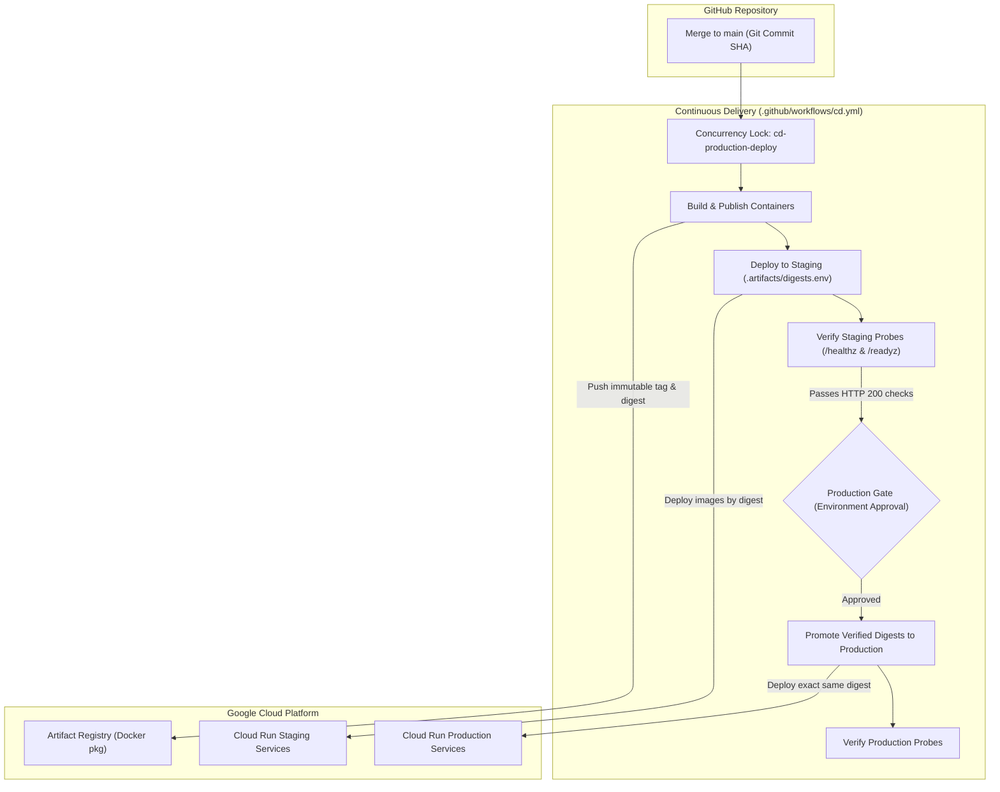

# PetSpotR Continuous Delivery Pipeline Architecture

This document describes the end-to-end continuous delivery (CD) architecture, Artifact Registry integration, Workload Identity Federation configuration, immutable digest promotion model, and Cloud Run deployment/rollback procedures for PetSpotR.

---

## 1. End-to-End Delivery Architecture

The PetSpotR delivery pipeline guarantees that software artifacts deployed to production are **immutable, verified in staging, traceable to source control, and protected against race conditions**.



### Key Architectural Principles
1. **Build Once, Promote Everywhere**: Container images are built exactly once per commit SHA and published to Google Artifact Registry. Staging and Production deploy the **exact same immutable SHA-256 digest**.
2. **Keyless Authentication via Workload Identity Federation**: GitHub Actions authenticates to Google Cloud via short-lived OIDC tokens. Long-lived service account JSON keys are strictly forbidden.
3. **Serialized Deployment Queuing**: Strict concurrency locking ensures earlier deployments cannot overtake newer releases.
4. **Automated Verification Before Gate**: Staging services must pass automated `/healthz` (liveness) and `/readyz` (readiness) probe validations before triggering the production environment protection gate.
5. **Instant Traffic Rollback**: Fast recovery shifts 100% traffic back to the previous healthy Cloud Run revision without rebuilding containers.

---

## 2. Regional Artifact Registry Integration

PetSpotR provisions regional Docker repositories using OpenTofu (`infra/opentofu/main.tf`):

```hcl
resource "google_project_service" "artifactregistry" {
  project            = var.project_id
  service            = "artifactregistry.googleapis.com"
  disable_on_destroy = false
}

resource "google_artifact_registry_repository" "petspotr" {
  project       = var.project_id
  location      = var.region
  repository_id = "petspotr"
  description   = "PetSpotR regional container image repository"
  format        = "DOCKER"

  depends_on = [google_project_service.artifactregistry]
}
```

### Image URI Structure
Container images are published to Artifact Registry using the regional repository format:

```
${LOCATION}-docker.pkg.dev/${PROJECT_ID}/petspotr/${SERVICE_NAME}:${COMMIT_SHA}
```

- **Location**: Regional endpoint (e.g., `us-central1`).
- **Project ID**: Google Cloud Project ID (e.g., `petspotr`).
- **Repository ID**: `petspotr`.
- **Services**:
  - `web-frontend`
  - `lostpet-service`
  - `foundpet-service`
  - `pet-matcher`
  - `notification-service`

### Immutable Digest Resolution
While images are tagged with the git commit SHA for human traceability (`:${{ github.sha }}`), deployments exclusively reference the cryptographic digest:

```
${LOCATION}-docker.pkg.dev/${PROJECT_ID}/petspotr/${SERVICE_NAME}@sha256:b16e8...
```

This prevents tag-mutability attacks and guarantees reproducibility.

---

## 3. Workload Identity Federation Setup

GitHub Actions authenticates to Google Cloud without storing private keys by leveraging OIDC federated tokens.

### Infrastructure Setup Steps

#### 1. Create Workload Identity Pool and Provider
```bash
# Create Workload Identity Pool
gcloud iam workload-identity-pools create "github-actions-pool" \
  --project="${PROJECT_ID}" \
  --location="global" \
  --display-name="GitHub Actions Pool"

# Create OIDC Provider
gcloud iam workload-identity-pools providers create-oidc "github-actions-provider" \
  --project="${PROJECT_ID}" \
  --location="global" \
  --workload-identity-pool="github-actions-pool" \
  --issuer-uri="https://token.actions.githubusercontent.com" \
  --attribute-mapping="google.subject=assertion.sub,attribute.actor=assertion.actor,attribute.repository=assertion.repository" \
  --attribute-condition="assertion.repository == 'scottdensmore/PetSpotR'"
```

#### 2. Create Deployer Service Account
```bash
gcloud iam service-accounts create "github-cd-deployer" \
  --project="${PROJECT_ID}" \
  --display-name="GitHub Actions Continuous Delivery Service Account"

# Grant required deployment roles
gcloud projects add-iam-policy-binding "${PROJECT_ID}" \
  --member="serviceAccount:github-cd-deployer@${PROJECT_ID}.iam.gserviceaccount.com" \
  --role="roles/artifactregistry.writer"

gcloud projects add-iam-policy-binding "${PROJECT_ID}" \
  --member="serviceAccount:github-cd-deployer@${PROJECT_ID}.iam.gserviceaccount.com" \
  --role="roles/run.admin"

gcloud projects add-iam-policy-binding "${PROJECT_ID}" \
  --member="serviceAccount:github-cd-deployer@${PROJECT_ID}.iam.gserviceaccount.com" \
  --role="roles/iam.serviceAccountUser"
```

#### 3. Bind Workload Identity User Role
Allow GitHub Actions runs originating from the repository `main` branch to impersonate the service account:

```bash
gcloud iam service-accounts add-iam-policy-binding \
  "github-cd-deployer@${PROJECT_ID}.iam.gserviceaccount.com" \
  --project="${PROJECT_ID}" \
  --role="roles/iam.workloadIdentityUser" \
  --member="principalSet://iam.googleapis.com/projects/${PROJECT_NUMBER}/locations/global/workloadIdentityPools/github-actions-pool/attribute.repository/scottdensmore/PetSpotR"
```

#### 4. Configure GitHub Repository Secrets / Variables
In GitHub repository settings (`Settings -> Secrets and variables -> Actions`):
- `GCP_WORKLOAD_IDENTITY_PROVIDER`: `projects/${PROJECT_NUMBER}/locations/global/workloadIdentityPools/github-actions-pool/providers/github-actions-provider`
- `GCP_SERVICE_ACCOUNT`: `github-cd-deployer@${PROJECT_ID}.iam.gserviceaccount.com`

---

## 4. Pipeline Execution & Concurrency Controls

The CD pipeline is defined in `.github/workflows/cd.yml`.

### Concurrency Lock
To prevent race conditions where a newer commit completes before an older commit or two deployments clash in Cloud Run:

```yaml
concurrency:
  group: cd-production-deploy
  cancel-in-progress: false
```

- `cancel-in-progress: false` queues builds sequentially rather than aborting mid-flight deployments.
- `group: cd-production-deploy` serializes all pipeline runs targeting environments.

### Pipeline Stages

1. **Build & Publish**:
   - Executes `docker buildx build` against `Dockerfile` using `--build-arg SERVICE_NAME=<svc>`.
   - Pushes images tagged with `${{ github.sha }}`.
   - Extracts SHA-256 digest from Artifact Registry and generates `.artifacts/digests.env`.
   - Uploads `container-digests` build artifact.

2. **Deploy Staging**:
   - Deploys container digests to staging services (`${SERVICE}-staging`).
   - Asserts that `/healthz` (liveness) and `/readyz` (readiness) HTTP probes respond with status code `200 OK`.

3. **Deploy Production Gate**:
   - Gated behind GitHub Environment `production` protection rules (requiring manual approval from designated approvers).
   - Once approved, deploys the exact verified digest to production services.
   - Verifies production `/healthz` and `/readyz` endpoints.

---

## 5. Rollback Procedures

If an incident occurs following a production deployment, do not attempt to re-compile or push a hotfix commit under pressure. **Shift traffic immediately to the previous healthy revision.**

### Fast Rollback Command
Cloud Run revisions are immutable. To revert 100% of user traffic to a known-healthy revision:

```bash
gcloud run services update-traffic <SERVICE> \
  --to-revisions=<REVISION>=100 \
  --region=<REGION> \
  --project=<PROJECT_ID>
```

#### Service Examples

- **Web Frontend**:
  ```bash
  gcloud run services update-traffic web-frontend \
    --to-revisions=web-frontend-00044-xyz=100 \
    --region=us-central1 \
    --project=petspotr
  ```

- **Lost Pet Service**:
  ```bash
  gcloud run services update-traffic lostpet-service \
    --to-revisions=lostpet-service-00032-xyz=100 \
    --region=us-central1 \
    --project=petspotr
  ```

- **Found Pet Service**:
  ```bash
  gcloud run services update-traffic foundpet-service \
    --to-revisions=foundpet-service-00030-xyz=100 \
    --region=us-central1 \
    --project=petspotr
  ```

- **Pet Matcher**:
  ```bash
  gcloud run services update-traffic pet-matcher \
    --to-revisions=pet-matcher-00028-xyz=100 \
    --region=us-central1 \
    --project=petspotr
  ```

- **Notification Service**:
  ```bash
  gcloud run services update-traffic notification-service \
    --to-revisions=notification-service-00019-xyz=100 \
    --region=us-central1 \
    --project=petspotr
  ```

### Rollback Verification Checklist
1. Query traffic distribution:
   ```bash
   gcloud run services describe <SERVICE> --region=<REGION> --format="value(status.traffic)"
   ```
   Confirm `percent: 100` targets the intended revision.
2. Probe endpoints:
   ```bash
   SERVICE_URL=$(gcloud run services describe <SERVICE> --region=<REGION> --format="value(status.url)")
   curl -sf -o /dev/null -w "%{http_code}\n" "${SERVICE_URL}/healthz"
   curl -sf -o /dev/null -w "%{http_code}\n" "${SERVICE_URL}/readyz"
   ```
3. For comprehensive incident remediation instructions and outbox schema safety protocols, consult [Operational Runbook: Cloud Run Fast Rollback](file:///docs/runbooks/rollback.md).
