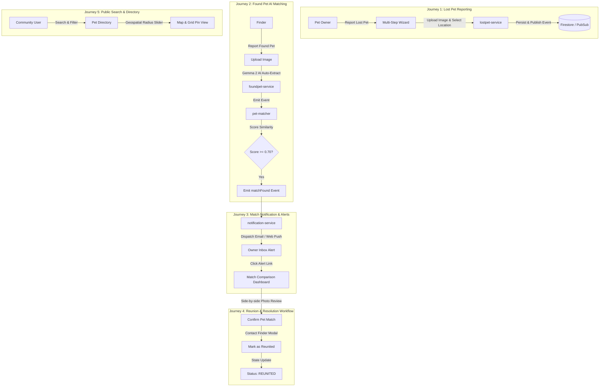

# PetSpotR Productization Roadmap & E2E User Journeys

This document serves as the master product roadmap for transforming the
PetSpotR event-driven microservices architecture into a modern, real-world
consumer product.

---

## 🎯 Executive Summary & Product Vision

PetSpotR is an event-driven AI platform designed to reunite lost pets with their
owners using vision AI inference (**Ollama & Gemma 2**), geospatial proximity
calculations, real-time event streaming (**Cloud Pub/Sub**), and scalable
cloud infrastructure (**GCP Cloud Run, Cloud Firestore, GCS**).

While the core microservice architecture and Go domain models are implemented,
turning PetSpotR into a fully featured product requires:

1. **Modern Interface & Web Frontend App**: Intuitive, responsive, and visually
   stunning web application supporting dark/light modes, multi-step reporting
   wizards, visual side-by-side AI match comparison dashboards, and interactive
   maps.
2. **Comprehensive E2E User Journeys**: Full automated test coverage driving
   browser workflows with Playwright and backend event cascades.
3. **Backend & API Modernization**: Geospatial distance weighting, signed direct
   image uploads to GCS, user account sessions, multi-channel notifications
   (Email/SMS/Push), and OpenTelemetry observability.
4. **CI/CD & Cloud Deployment**: Continuous deployment pipelines and OpenTofu
   infrastructure for frontend web hosting.

---

## 🎨 Modern Interface Design System & Aesthetics

Per our UI specifications, the modern PetSpotR interface follows these design
principles:

- **Curated Color Palette**: HSL-tailored colors with midnight dark mode
  background (`#0b0f19`), neon accents (`#6366f1` / `#8b5cf6`), and soft
  glassmorphism overlays (`rgba(255, 255, 255, 0.05)` backdrop blur).
- **Modern Typography**: Inter and Outfit Google Fonts for high legibility
  across screens.
- **Micro-Animations**: Smooth transition effects (`150ms ease-in-out`), hover
  scale transformations, live drop zones, and dynamic score progress rings.
- **Viewport Responsiveness**: Full layout adaptation across Mobile (`<640px`),
  Tablet (`640px–1024px`), and Desktop (`>1024px`) viewports.
- **Accessibility & UX**: Keyboard navigation (WCAG 2.1 AA compliant), focus
  ring indicators, and semantic HTML5 structures.

---

## 🗺️ E2E User Journeys

The product experience is defined around five core end-to-end user journeys:

### Detailed Journey Specifications

1. **Journey 1: Lost Pet Registration & Location Tagging**
   - **User Role**: Pet Owner whose pet has gone missing.
   - **Steps**: Navigates to web app -> Clicks "Report Lost Pet" -> Fills
     multi-step wizard (name, species, breed, primary/secondary colors,
     microchip ID, text description) -> Selects last-seen location via
     interactive map picker -> Uploads pet photo with client-side image
     compression -> Submits report.
   - **System Outcome**: `lostpet-service` stores report in Firestore, saves
     image in GCS, and emits `lostPet` CloudEvent.

2. **Journey 2: Found Pet Report & Automated AI Matching**
   - **User Role**: Finder who spotted or rescued a stray pet.
   - **Steps**: Opens "Report Found Pet" page -> Uploads pet photo -> Gemma 2
     vision model automatically detects and pre-fills species, breed, and color
     tags -> Selects location and custody status -> Submits.
   - **System Outcome**: `foundpet-service` stores record and emits `foundPet`
     event -> `pet-matcher` extracts features, computes similarity matrix
     against active lost pets, and emits `matchFound` event if score >= 0.70.

3. **Journey 3: Real-Time Match Notification & Alerting**
   - **User Role**: Pet Owner receiving an alert.
   - **Steps**: `matchFound` event triggers `notification-service` -> Dispatches
     formatted HTML alert email and web push notification with preview image ->
     Owner clicks link in notification -> Takes user directly to candidate
     match view.

4. **Journey 4: Interactive Match Review & Reunion Resolution**
   - **User Role**: Pet Owner verifying candidate match.
   - **Steps**: Owner views side-by-side photo comparison slider and AI score
     breakdown -> Clicks "Confirm Match & Contact Finder" -> Communicates via
     secure contact modal -> Meets finder -> Clicks "Mark Pet as Reunited" ->
     System displays celebration screen and updates listing state to `REUNITED`.

5. **Journey 5: Search & Geospatial Radius Directory**
   - **User Role**: General Public / Shelter Operator.
   - **Steps**: User visits `/pets` directory -> Enters search query ("Golden
     Retriever") -> Adjusts distance slider to 10 miles -> Toggles between Map
     Pin view and Grid view -> Filters by date range -> Reviews detail modal.

---

## 📋 GitHub Issue Registry & Milestone Tracking

All productization tasks have been pre-authorized and created as tracked GitHub
issues with Conventional Commit titles and `agent-found` labels:

### Milestone 1: Modern Web Frontend & Interface App

- [#50](https://github.com/scottdensmore/PetSpotR/issues/50) —
  `feat(frontend): implement modern web design system and responsive layout shell`
- [#51](https://github.com/scottdensmore/PetSpotR/issues/51) —
  `feat(frontend): implement interactive lost pet report wizard with image upload & live AI preview`
- [#52](https://github.com/scottdensmore/PetSpotR/issues/52) —
  `feat(frontend): implement found pet reporting interface with AI attribute auto-extraction`
- [#53](https://github.com/scottdensmore/PetSpotR/issues/53) —
  `feat(frontend): implement pet match comparison dashboard with visual side-by-side scoring breakdown`
- [#54](https://github.com/scottdensmore/PetSpotR/issues/54) —
  `feat(frontend): implement pet reunion & resolution workflow modal with owner contact system`
- [#55](https://github.com/scottdensmore/PetSpotR/issues/55) —
  `feat(frontend): implement interactive lost & found pet directory with geospatial radius filter`

### Milestone 2: Comprehensive Playwright E2E User Journeys

- [#56](https://github.com/scottdensmore/PetSpotR/issues/56) —
  `test(e2e): implement Playwright user journey for lost pet reporting and photo upload`
- [#57](https://github.com/scottdensmore/PetSpotR/issues/57) —
  `test(e2e): implement Playwright user journey for found pet reporting and AI matching cascade`
- [#58](https://github.com/scottdensmore/PetSpotR/issues/58) —
  `test(e2e): implement Playwright user journey for match notification alert and email verification`
- [#59](https://github.com/scottdensmore/PetSpotR/issues/59) —
  `test(e2e): implement Playwright user journey for match confirmation and reunion resolution`
- [#60](https://github.com/scottdensmore/PetSpotR/issues/60) —
  `test(e2e): implement Playwright user journey for search, geospatial radius filtering, and pagination`

### Milestone 3: Backend & API Production Features

- [#61](https://github.com/scottdensmore/PetSpotR/issues/61) —
  `feat(api): integrate geospatial location indexing and distance-weighted matching`
- [#62](https://github.com/scottdensmore/PetSpotR/issues/62) —
  `feat(api): implement GCS signed URL direct upload pipeline for pet images`
- [#63](https://github.com/scottdensmore/PetSpotR/issues/63) —
  `feat(api): add authentication, user account sessions, and listing management endpoints`
- [#64](https://github.com/scottdensmore/PetSpotR/issues/64) —
  `feat(api): implement OpenTelemetry tracing, structured logging, and health/readiness probes`
- [#65](https://github.com/scottdensmore/PetSpotR/issues/65) —
  `feat(api): implement multi-channel notification engine (Email, SMS, Web Push)`

### Milestone 4: Infrastructure & CI/CD Automation

- [#66](https://github.com/scottdensmore/PetSpotR/issues/66) —
  `feat(infra): update OpenTofu configuration for Go Web frontend Cloud Run deployment`
- [#67](https://github.com/scottdensmore/PetSpotR/issues/67) —
  `chore(ci): expand GitHub Actions workflow to run Playwright UI E2E suite against local stack`

---

## ⚡ Developer & Agent Execution Discipline

When working on any slice from this roadmap, agents must strictly follow the
workflow set out in [`AGENTS.md`](../AGENTS.md):

1. Create a dedicated branch (`feat/<slice-name>` or `fix/<slice-name>`).
2. Follow Test-Driven Development (TDD).
3. Run `ui-review` sub-agent for UI changes.
4. Run `verifier` sub-agent (`go vet`, `go test -race`, `golangci-lint`,
   `markdownlint`, `tofu validate`).
5. Run `code-review` sub-agent before every commit.
6. Submit pull requests using Conventional Commit titles.
