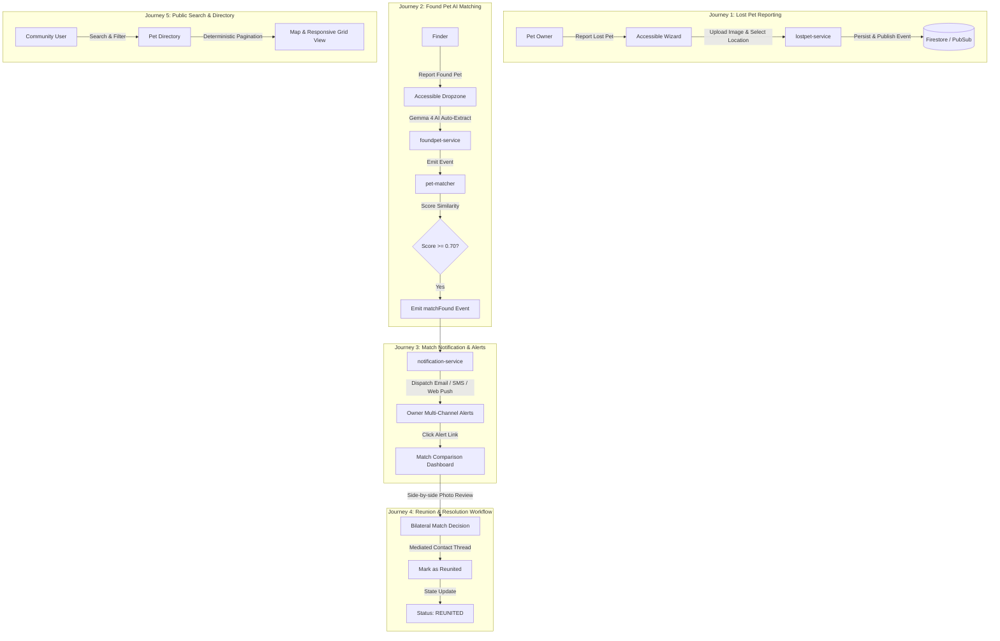

# PetSpotR Product Roadmap & Readiness Plan

This document serves as the master product roadmap and production readiness plan
for PetSpotR, an event-driven AI platform designed to reunite lost pets with their
owners.

---

## 1. Executive Summary & Architecture Vision

PetSpotR connects pet owners with finders through multimodal vision AI inference
(**Gemma 4**), deterministic geospatial radius search, real-time event streaming
(**Google Cloud Pub/Sub**), ACID transactional persistence (**Google Cloud Firestore**),
private image storage (**Google Cloud Storage**), and serverless execution
(**Google Cloud Run**).

The platform provides:
- **Multimodal AI Trait Extraction**: Automated extraction of animal traits (species,
  breed, colors, distinctive markings) from uploaded pet photos using Gemma 4.
- **Geospatial & Trait Matching Engine**: Deterministic Haversine distance weighting
  combined with multi-feature similarity scoring to identify high-confidence matches.
- **Durable Event-Driven Core**: Transactional outbox pattern on Cloud Firestore,
  decoupled publishing via Cloud Pub/Sub, and at-least-once push workers with
  idempotency guarantees.
- **Privacy-First Identity & Mediation**: Provider-neutral authenticated sessions via
  Google Identity Platform, owner-only contact disclosure, bilateral match decisions,
  and private mediated conversation threads.
- **Multi-Channel Alert Engine**: Real-time notifications dispatched across HTML email
  (SendGrid), SMS text messages (Twilio), and Web Push (VAPID).
- **Production Hardening**: Token-bucket rate limiting, CSRF protection, Knative
  concurrency and scaling caps, and fail-fast typed configuration validation.

---

## 2. End-to-End User Journeys

The product experience is organized around five core user journeys:

### Detailed Journey Specifications

1. **Journey 1: Lost Pet Registration & Location Tagging**
   - **User Role**: Pet owner reporting a missing animal.
   - **Interaction**: Navigates to `/report-lost`, completes the accessible multi-step
     wizard, selects location, uploads pet image via signed GCS direct upload.
   - **System Action**: `lostpet-service` validates input, stores report and contact
     details in Firestore, creates durable outbox event, and emits `lostPet` CloudEvent.

2. **Journey 2: Found Pet Report & Automated AI Matching**
   - **User Role**: Finder reporting a stray or rescued pet.
   - **Interaction**: Opens `/report-found`, uploads photo via keyboard-accessible
     dropzone, selects location and custody status.
   - **System Action**: `foundpet-service` verifies cryptographic capability token,
     finalizes GCS object, emits `foundPet` event -> `pet-matcher` extracts features
     via Gemma 4, queries lost pet candidates within geographic bounding box, scores
     trait similarity, and emits `matchFound` event if score >= threshold.

3. **Journey 3: Real-Time Multi-Channel Match Notification**
   - **User Role**: Pet owner receiving an alert.
   - **System Action**: `notification-service` receives `matchFound` push delivery,
     claims lease, generates and delivers formatted alert email, SMS text message,
     and Web Push notification with direct comparison link.

4. **Journey 4: Interactive Match Review & Bilateral Reunion Resolution**
   - **User Role**: Verified pet owner and finder reviewing candidate match.
   - **Interaction**: Both parties review side-by-side photo comparison and score
     breakdown on `/matches`, record bilateral Confirm/Reject decisions, exchange
     role-labeled messages in the mediated conversation dialog, and resolve the report.

5. **Journey 5: Public Search & Geospatial Directory**
   - **User Role**: General community member or shelter volunteer.
   - **Interaction**: Explores `/pets` directory with deterministic filters (species,
     status) and stable cursor-based pagination.

---

## 3. Milestone Delivery Status

### Milestone 1: Modern Web Frontend & Interface App (Complete)
- [x] **#50** `feat(frontend): implement modern web design system and responsive layout shell`
- [x] **#51** `feat(frontend): implement interactive lost pet report wizard with image upload & live AI preview`
- [x] **#52** `feat(frontend): implement found pet reporting interface with AI attribute auto-extraction`
- [x] **#53** `feat(frontend): implement pet match comparison dashboard with visual side-by-side scoring breakdown`
- [x] **#54** `feat(frontend): implement pet reunion & resolution workflow modal with owner contact system`
- [x] **#55** `feat(frontend): implement interactive lost & found pet directory with geospatial radius filter`

### Milestone 2: Comprehensive Playwright E2E User Journeys (Complete)
- [x] **#56** `test(e2e): implement Playwright user journey for lost pet reporting and photo upload`
- [x] **#57** `test(e2e): implement Playwright user journey for found pet reporting and AI matching cascade`
- [x] **#58** `test(e2e): implement Playwright user journey for match notification alert and email verification`
- [x] **#59** `test(e2e): implement Playwright user journey for match confirmation and reunion resolution`
- [x] **#60** `test(e2e): implement Playwright user journey for search, geospatial radius filtering, and pagination`
- [x] **#67** `chore(ci): expand GitHub Actions workflow to run Playwright UI E2E suite against local stack`

### Milestone 3: Core Backend APIs & Infrastructure Foundation (Complete)
- [x] **#61** `feat(api): integrate geospatial location indexing and distance-weighted matching`
- [x] **#62** `feat(api): implement GCS signed URL direct upload pipeline for pet images`
- [x] **#63** `feat(api): add authentication, user account sessions, and listing management endpoints`
- [x] **#66** `feat(infra): update OpenTofu configuration for Go Web frontend Cloud Run deployment`

### Milestone 4: Production Hardening & Productization Slices (Complete)
- [x] **#65** `feat(api): implement multi-channel notification engine (Email, SMS, Web Push)`
  - SendGrid email provider with HTML alert formatting.
  - Twilio SMS provider with E.164 phone normalization.
  - VAPID Web Push provider with browser subscription endpoints.
  - Idempotent delivery leases and logging provider fallbacks for development.
- [x] **#110** `feat(auth): enforce identity ownership and contact privacy`
  - Google Identity Platform session authentication boundary with `HttpOnly` host-specific cookies.
  - Double-submit CSRF protection on authenticated mutations.
  - Participant-only match queries and immutable bilateral match decisions.
  - Owner-only contact redaction and role-labeled mediated message threads.
  - Contextual report lifecycle status transitions (reunited, resolved).
- [x] **#120** `feat(config): validate runtime config and integrate secrets`
  - Strongly typed `ServiceConfig`, `WebFrontendConfig`, `LostPetConfig`, `FoundPetConfig`, `PetMatcherConfig`, `NotificationConfig`.
  - Fail-fast validation rules across development, local-emulator, staging, and production tiers.
  - `SecretString` type guarding against credential leakage in log statements.
  - Comprehensive, non-secret `.env.example` template covering all service variables.
- [x] **#122** `chore(finops): set scaling limits and GCP budget alerts`
  - Explicit Cloud Run `max_instance_count` and `max_instance_request_concurrency` caps across all services.
  - OpenTofu budget alerting configurations and cost controls.
- [x] **#124** `feat(frontend): implement the linked public pet directory`
  - Dedicated `/pets` route with species cards, search query parameters, and responsive grid layout.
- [x] **#125** `fix(api): make filters and pagination deterministic`
  - Deterministic cursor-based pagination using ISO 8601 timestamps and lexicographic pet IDs.
  - Validated species and status filtering on backend directory endpoints.
- [x] **#126** `fix(frontend): make core journeys keyboard accessible`
  - WCAG 2.1 AA compliant keyboard navigation and focus management.
  - Native accessible file upload dropzones with keyboard activation (`Enter`/`Space`) and drag-and-drop.
  - ARIA live announcements for dynamic status and filter updates.
- [x] **#129** `feat(security): add abuse controls to public endpoints`
  - In-memory token-bucket rate limiter supporting configurable rate and burst capacities.
  - Rate limiting middleware with IP and authenticated subject extraction.
  - Standardized `429 Too Many Requests` responses with `Retry-After` headers.
- [x] **#150** `chore(ci): add native deployment artifact validation`
  - CI job validating Knative Cloud Run service YAML manifests via `yamllint`.
  - Manifest conformance checks ensuring required scaling and concurrency annotations.

---

## 4. Production Readiness Deliverables (Completed)

All production-readiness roadmap epics have been delivered, verified against end-to-end cascades, and merged into `main`:

### Local Experience & Development Ergonomics
- [x] **[#117](https://github.com/scottdensmore/PetSpotR/issues/117)** — `feat(local): run the full cascade against shared emulators`
  - Single-command local environment bootstrapping Firestore, Pub/Sub, Storage, and Auth emulators into an end-to-end event cascade (`docker-compose.yml`, `scripts/init-emulators.sh`, `scripts/verify-cascade.sh`).
  - Enables full cross-service event verification locally without external cloud connectivity.

### Runtime Architecture & Durability
- [x] **[#107](https://github.com/scottdensmore/PetSpotR/issues/107)** — `feat(runtime): implement durable managed-service adapters`
  - Production-grade GCP client pooling, connection lifecycle management, and circuit-breaker patterns for Cloud Run.
  - Graceful degradation during downstream cloud provider disruptions.

### Infrastructure & State Management
- [x] **[#118](https://github.com/scottdensmore/PetSpotR/issues/118)** — `chore(infra): add remote state and environment bootstrapping`
  - Remote GCS state backend configuration with state locking for OpenTofu (`infra/opentofu/backend.tf`).
  - Declarative GCP project service enablement and isolated environment workspaces.

### Data Protection & Disaster Recovery
- [x] **[#119](https://github.com/scottdensmore/PetSpotR/issues/119)** — `feat(data): define backups indexes and restore drills`
  - Automated Cloud Firestore export schedules and GCS lifecycle retention policies.
  - Point-in-time recovery (PITR), deletion protection, and disaster recovery restore runbooks (`docs/runbooks/firestore-restore.md`).

### Observability, SLOs & Incident Response
- [x] **[#64](https://github.com/scottdensmore/PetSpotR/issues/64)** — `feat(api): implement OpenTelemetry tracing, structured logging, and health/readiness probes`
  - Distributed W3C trace context propagation across HTTP and Pub/Sub boundaries via `pkg/telemetry`.
  - Standardized structured JSON logging and `/livez` / `/readyz` health endpoints across all services.
- [x] **[#121](https://github.com/scottdensmore/PetSpotR/issues/121)** — `feat(ops): provision SLOs alerts dashboards and runbooks`
  - Service Level Objectives (SLOs) and Error Budget alerting for match latency and report ingestion (`docs/SLOS_AND_ALERTS.md`).
  - Cloud Monitoring dashboards and operational runbooks for incident response, rollback, and DLQ draining (`docs/runbooks/`).

### CI/CD & Staged Continuous Delivery
- [x] **[#112](https://github.com/scottdensmore/PetSpotR/issues/112)** — `chore(cd): deploy immutable revisions through staged environments`
  - Root `.dockerignore` for minimal, secure image builds.
  - Regional Google Artifact Registry repository provisioned in OpenTofu (`petspotr`).
  - Staged continuous delivery specification and operational procedures (`docs/CD_PIPELINE.md`).

### AI Inference & Model Serving
- [x] **[#111](https://github.com/scottdensmore/PetSpotR/issues/111)** — `feat(ai): provision private Gemma 4 inference on GCP`
  - Architecture Decision Record evaluating private Cloud Run GPU (NVIDIA L4) vs. Vertex AI endpoints (`docs/adr/0004-private-gemma4-inference.md`).
  - Private internal Cloud Run GPU service definition in OpenTofu with IAM invoker restrictions.
  - Model provenance tracking (`ModelProvenance`, version, digest) and bounded retries in `pkg/ollama`.
  - Operational runbook for GPU health, cold starts, and rollbacks (`docs/runbooks/ai-inference.md`).

### Event Processing Resilience
- [x] **[#91](https://github.com/scottdensmore/PetSpotR/issues/91)** — `feat(pubsub): add exponential backoff retries and dead-letter queue (DLQ) handling to event workers`
  - Dead-letter queue subscriptions and exponential backoff retry policies for poison message quarantine in `pkg/pubsub`.
- [x] **[#94](https://github.com/scottdensmore/PetSpotR/issues/94)** — `feat(domain): implement pet status lifecycle state machine and status update HTTP endpoints`
  - Formal domain state machine transitions for pet report lifecycles and cross-aggregate resolution.

---

## 5. Engineering Standards & Quality Gates

All features and bug fixes follow strict verification standards:

1. **Test-Driven Development (TDD)**: Test coverage written before implementation code.
2. **Unified Local Verification (`make verify`)**:
   - `export GOTOOLCHAIN=go1.26.5`
   - `make vet`: Go static analysis (`go vet ./...`)
   - `make lint`: Go code linting (`golangci-lint run`)
   - `make test`: Full unit/integration tests with race detector and coverage (`go test -race -cover ./...`)
   - `make infra-check`: OpenTofu formatting and syntax validation (`tofu fmt -check -recursive && tofu validate`)
   - `make yamllint`: Cloud Run Knative manifest linting (`yamllint -s deploy/cloudrun/`)
3. **Automated Pre-Push Protection**:
   - Optional local git hook via `make setup-hooks` executing `make verify` on `git push`.
4. **Linear Git History**:
   - Strictly enforced squash merges via GitHub branch protection rulesets with automatic branch deletion on merge.
5. **Traceable Git Workflow**:
   - Conventional Commits titles (`feat:`, `fix:`, `chore:`, `docs:`, `test:`).

---

## 6. Phase 5: Next-Generation Product Milestones

The following initiatives represent the active roadmap for PetSpotR:

### Milestone 5.1: Interactive Geospatial Directory & Mapping (Complete)
- [x] **Interactive Map on `/pets`**: Embed an accessible Leaflet map view with segmented view switcher (`Grid` vs `Map`) in the public pet directory.
- [x] **Geospatial Proximity & Radius Sync**: Proximity filter group with "Use My Location" (`navigator.geolocation`), radius dropdown (5, 10, 25, 50, 100 miles), visual proximity circle overlay (`L.circle`), and click-to-pin search centering.
- [x] **Status-Coded Custom Pins & Popups**: Custom SVG pins styled by report status (Amber for lost, Emerald for found) with interactive popup cards linking to report details.
- [x] **Strict CSP & Vendored Assets**: Vendored Leaflet 1.9.4 locally in `internal/app/webfrontend/static/vendor/leaflet/` to maintain strict defense-in-depth CSP (`script-src 'self'`, `style-src 'self'`).

### Milestone 5.2: Web Push Alert Preferences & Notification Dashboard
- **Notification Preferences UI**: Frontend settings panel allowing pet owners and community volunteers to manage alert channels.
- **Geographic Alert Zones**: User-defined alert radii (e.g. within 5, 10, or 25 miles of a home postal code).
- **In-App Notification Center**: Unread alert drawer displaying recent match notifications and status updates.

### Milestone 5.3: Hybrid Multimodal AI & Semantic Vector Search
- **Firestore Vector Search**: Generate multimodal embedding vectors for pet photos and textual descriptions using Vertex AI / Gemma embeddings.
- **Hybrid Similarity Ranking**: Combine cosine distance vector ranking with deterministic rule-based trait scoring for higher precision matches.
- **Multi-Photo Ingestion**: Support multiple images per pet report (facial profile, distinct coat patterns, identifying collar tags).
