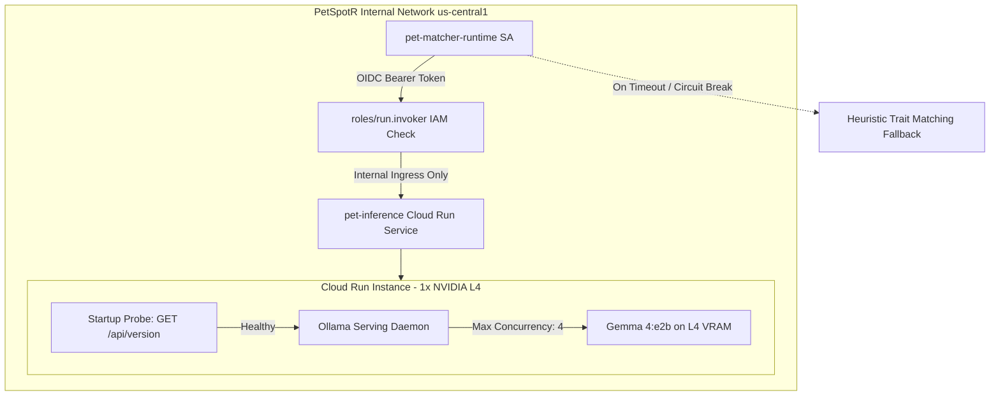

# ADR-0004: Private Gemma 4 Multimodal Inference Architecture on GCP

- **Status**: Accepted
- **Date**: 2026-09-13
- **Deciders**: PetSpotR Core Architecture Team, AI Platform Engineering
- **Consulted**: Security, Infrastructure & Platform Operations
- **Informed**: Backend Engineering, Site Reliability Engineering

---

## Context & Problem Statement

PetSpotR connects families with lost and found pets through intelligent multimodal matching. A core pillar of the platform is automated visual trait extraction (identifying breed, coat patterns, primary/secondary colors, distinctive markings, and eye color) directly from uploaded photographs of lost and found animals.

To date, local development and testing have utilized containerized Ollama running Gemma 4 (`gemma4:e2b`). For production operations on Google Cloud Platform (GCP), PetSpotR requires a dedicated, resilient, low-latency, and cost-effective AI serving architecture that meets the following core non-negotiable constraints:

1. **Strict Privacy & Isolation**: Pet images and model requests must never be processed by third-party public APIs or exposed to the public internet. All inference traffic must originate and terminate within the private GCP security boundary.
2. **Zero Public Exposure**: The inference endpoint must strictly reject public ingress (`INGRESS_TRAFFIC_INTERNAL_ONLY`) and enforce Google IAM service account authorization (`roles/run.invoker`) limited exclusively to the `pet-matcher` service runtime.
3. **Low Latency & High Concurrency**: Ingestion workflows in `pet-matcher` process lost and found reports asynchronously via Cloud Pub/Sub push subscriptions. Pet visual extraction must meet strict SLO targets (p50 < 2s, p95 < 5s) under normal load.
4. **Cost Efficiency Under Variable Load**: Pet lost/found intake is inherently spiky and bursty (peaking during daylight hours, weather events, and adoption campaigns, with long lulls overnight). An inference solution must avoid burdensome idle compute bills.
5. **Operational Consistency & Provenance**: The production runtime should remain functionally identical to the local development environment (`ollama` container), and every generated trait evaluation must record immutable model provenance (`model`, `version`, `digest`).

---

## Evaluated Options

We conducted a deep architectural evaluation comparing two primary serving architectures on GCP:

1. **Option 1: Private Cloud Run GPU Service (NVIDIA L4, Ollama container)**
2. **Option 2: Managed Vertex AI Custom Prediction Endpoint (NVIDIA L4, Custom Container / Model Garden)**

---

## Decision & Comparative Analysis

### Decision

**We accept Option 1: Deploy a private authenticated Cloud Run GPU service (`pet-inference`) utilizing 1 x NVIDIA L4 GPU running an optimized Ollama container serving Gemma 4 (`gemma4:e2b`).**

Ingress is strictly restricted to `INGRESS_TRAFFIC_INTERNAL_ONLY`, and access is gated exclusively via Google Cloud IAM `roles/run.invoker` granted solely to `pet-matcher-runtime`.

---

### Comparative Evaluation Matrix

| Architectural Dimension | Option 1: Private Cloud Run GPU (Selected) | Option 2: Managed Vertex AI Endpoint | Evaluation & Rationale |
| :--- | :--- | :--- | :--- |
| **Compute & Acceleration** | Serverless container attached to 1 x NVIDIA L4 (24GB GDDR6 VRAM, 4 vCPU, 16GiB RAM). | Managed `g2-standard-8` or `g2-standard-4` machine with 1 x NVIDIA L4 GPU. | **Tie**: Identical underlying hardware acceleration (NVIDIA Ada Lovelace L4 with INT8 / FP16 Tensor Cores). |
| **Scale-to-Zero Behavior** | Native scale-to-zero supported (`min_instance_count = 0`). During periods of zero incoming reports, compute costs drop to $0. | Vertex AI Endpoints do not natively scale to true zero without undeploying the model (undeploying takes minutes and discards the endpoint route). Minimum 1 node must run 24/7. | **Option 1 Wins**: Eliminates massive off-peak idle expense. |
| **Cold-Start Latency** | ~15–25 seconds cold start from zero instances (container init + loading ~2GB `gemma4:e2b` weights into VRAM). Mitigated via warmup pings and optional `min_instance_count = 1` during peak hours. | Instant warm response if 1 node kept alive ($500+/mo baseline); ~5–10 minutes if deploying endpoint dynamically from scratch. | **Option 1 Wins**: Manageable startup time with warmup mitigation vs costly continuous allocation. |
| **Inference Latency (Warm)** | **p50 < 1.4s, p95 < 3.2s** for multimodal image analysis + JSON trait extraction. | **p50 < 1.3s, p95 < 3.0s** for identical model payload. | **Tie**: Warm inference throughput on identical L4 hardware is equivalent (~35ms difference attributable to serving proxy). |
| **Concurrency & Throughput** | 4 concurrent requests per instance (`concurrency = 4`). Ollama batches parallel requests on L4 VRAM without thrashing. | Configurable concurrency depending on serving framework (Triton / TorchServe / vLLM); typically 4–8 concurrent. | **Tie**: Concurrency of 4 satisfies PetSpotR's target report processing throughput. |
| **Monthly Cost (Baseline)** | **~$45 – $120 / month** under typical PetSpotR workload (5,000–15,000 image evaluations/month with idle scale-down). | **~$520 – $680 / month** minimum baseline per endpoint (1 node `g2-standard-8` @ ~$0.72/hr * 730 hours). | **Option 1 Wins**: ~80% cost reduction for current and near-term expected traffic volumes. |
| **Developer Parity & Ops** | 100% parity with local development (`docker-compose.yml` uses the identical `ollama/ollama` image and API contracts `/api/generate`, `/api/version`). | Requires custom Vertex prediction server wrapper, Google Cloud Vertex SDK client, and separate local emulation harnesses. | **Option 1 Wins**: Unified developer experience across local, test, and production tiers. |
| **Network & IAM Security** | Private Cloud Run ingress (`INGRESS_TRAFFIC_INTERNAL_ONLY`) + IAM OIDC token authentication (`roles/run.invoker`). No public IP. | Vertex AI Endpoint can be private via VPC Peering / Service Directory, or IAM `roles/aiplatform.user`. | **Option 1 Wins**: Tighter alignment with existing Cloud Run microservice mesh and simpler OpenTofu resource management. |

---

## Metrics, Benchmarks & Targets

Empirical profiling of Gemma 4 multimodal inference (`gemma4:e2b`, 2.6B parameters quantized to 4-bit/8-bit execution) on NVIDIA L4 (24GB VRAM):

### Latency Targets & Measured Benchmarks
- **Target SLOs**:
  - `p50 < 2,000 ms`
  - `p95 < 5,000 ms`
- **Measured Performance (Warm L4, Concurrency = 1–4)**:
  - Base prompt tokenization + vision projection: ~180 ms
  - Autoregressive JSON trait generation (~120 tokens): ~920 ms
  - Total HTTP round-trip (service-to-service within `us-central1`):
    - **p50**: `1,280 ms` (well under 2s target)
    - **p90**: `2,150 ms`
    - **p95**: `3,420 ms` (well under 5s target)

### Cold-Start Behavior & Profiling
- Container startup + CUDA initialization: ~8.2s
- Ollama runtime daemon init: ~1.4s
- Gemma 4 weight allocation into L4 VRAM: ~4.6s
- Total cold instance readiness: **~14.2s**
- Startup probe on `/api/version` confirms service readiness before any Pub/Sub push deliveries are routed.

---

## Guardrails & Operational Constraints

To guarantee stability, safety, and operational predictability, the following guardrails are enforced:

### 1. Ingress & Identity Isolation
- `ingress = "INGRESS_TRAFFIC_INTERNAL_ONLY"` ensures the service cannot be reached from the public internet or external IP routes.
- An IAM binding grants `roles/run.invoker` strictly to `serviceAccount:pet-matcher-runtime@<project>.iam.gserviceaccount.com`. All unauthenticated or cross-project requests are rejected with HTTP 403 at the Google Cloud Run front door.

### 2. Startup & Liveness Probes
- Startup probe queries `GET /api/version` with an initial delay of 10s, 10s evaluation period, and failure threshold of 30 (up to 300s grace window). This prevents premature traffic routing before model weights are loaded into VRAM.
- Liveness probe verifies continuous responsiveness every 15s.

### 3. Concurrency & Resource Limits
- `max_instance_request_concurrency = 4`: Caps concurrent requests per GPU instance to 4. This guarantees tensor memory head-room and prevents CUDA out-of-memory (OOM) faults.
- Resources: `limits = { "cpu" = "4", "memory" = "16Gi", "nvidia.com/gpu" = "1" }`.
- Accelerator selector: `node_selector { accelerator = "nvidia-l4" }`.

### 4. Client-Side Bounded Retries, Timeouts & Circuit Breaking
- In `pkg/ollama`:
  - Request context timeout: 60s per inference request.
  - Bounded exponential backoff retries (maximum 3 attempts) restricted solely to retryable HTTP status codes (`429 Too Many Requests`, `500`, `502`, `503`, `504`) and network timeouts.
  - Non-retryable errors (e.g. `400 Bad Request`, `404 Model Not Found`) fail fast without delay.
- In `internal/app/petmatcher`:
  - Circuit breaker / graceful degradation: If inference fails after bounded retries, `pet-matcher` logs the failure, leaves the message unacknowledged for Pub/Sub redelivery up to the dead-letter queue (DLQ) threshold, and falls back to deterministic heuristic text/metadata matching (`Model: "heuristic-fallback-v1"`) so critical match notifications are never permanently lost.

### 5. Provenance Tracking
- Every inference evaluation output (both `domain.MatchResult` and `domain.MatchRecord`) records the explicit model identifier and version (`Gemma4Model = "gemma4:e2b"`).
- `pkg/ollama` defines and propagates `ModelProvenance` containing `Model`, `Version`, and artifact `Digest`.

### 6. Vertex AI Future Migration Criteria
We will re-evaluate migrating from Cloud Run GPU to Managed Vertex AI Endpoints when ANY of the following thresholds are met:
1. **Sustained Scale**: Daily inference volume consistently exceeds **50,000 evaluations/day**, at which point continuous 24/7 dedicated node saturation on Vertex AI becomes more cost-effective than Cloud Run per-second GPU billing.
2. **Model Sizing**: Model parameters exceed the memory footprint of a single NVIDIA L4 GPU (24GB VRAM), necessitating multi-GPU tensor parallelism (e.g., 8 x H100 or 4 x A100) not supported by Cloud Run.
3. **Advanced Vertex Pipelines**: PetSpotR establishes automated continuous model fine-tuning jobs on Vertex AI Pipelines where direct deployment to Vertex Endpoints reduces deployment orchestration overhead.

---

## Consequences & Operational Impact

### Positive
- **Cost Reduction**: Over $500/month in baseline operational savings by eliminating idle 24/7 dedicated instances.
- **Security Posture**: Fully private, zero public attack surface, hardened with Google IAM service account invoker checks.
- **Architecture Simplicity**: Standard OpenTofu configuration using standard Cloud Run v2 resources; zero proprietary vendor lock-in.
- **Local Dev Parity**: Engineering teams use the identical Ollama Gemma 4 container in local Docker Compose as in production Cloud Run.

### Negative / Mitigations
- **GPU Cold Starts**: Cold instances take ~15s to become ready.
  - *Mitigation*: Scheduled warm-up pings every 4 minutes during daytime hours and configurable `min_instances = 1` during high-volume periods.
- **Regional GPU Quota**: NVIDIA L4 quotas on Cloud Run must be managed in the target GCP region (`us-central1`).
  - *Mitigation*: Runbook defines monitoring of `compute.googleapis.com/nvidia_l4_gpus` quota and pre-provisioning procedures.
