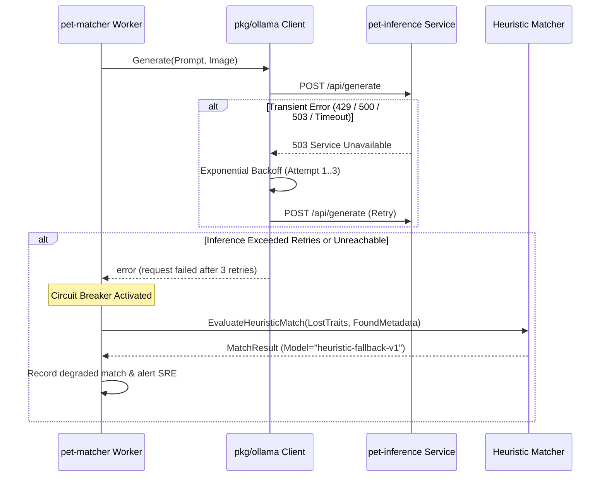

# Operational Runbook: Gemma 4 Private AI Inference Service

This runbook outlines operational procedures, health monitoring, quota administration, cold-start mitigation, degraded fallback behavior, and model revision management for PetSpotR's private Gemma 4 inference service (`pet-inference`).

---

## 1. Service Overview & Architecture

The `pet-inference` service provides private multimodal vision inference on Google Cloud Platform, serving Google Gemma 4 (`gemma4:e2b`) via an optimized Ollama runtime container.

- **Service Name**: `pet-inference`
- **Platform**: Google Cloud Run v2 (Serverless GPU)
- **Hardware Acceleration**: 1 x NVIDIA L4 (24GB GDDR6 VRAM, 4 vCPU, 16GiB Host RAM)
- **Model & Version Provenance**: `gemma4:e2b` (`sha256:7b49479b3922c153724c9c1b7530691efdfa3a60db6e30a5fbbeffbe4bfcb12d`)
- **Ingress Restriction**: `INGRESS_TRAFFIC_INTERNAL_ONLY` (no public IP or internet ingress)
- **Authorized Invoker**: `serviceAccount:pet-matcher-runtime@<project>.iam.gserviceaccount.com` (`roles/run.invoker`)
- **Primary Consumers**: `pet-matcher` (background Pub/Sub worker processing lost and found pet reports)

---

## 2. GPU Health Monitoring & Quota Management

### Key Metrics in Google Cloud Monitoring

Monitor the following metrics in the GCP Metrics Explorer or the PetSpotR AI Platform Monitoring Dashboard:

| Metric Name | Prometheus / GCP Metric Descriptor | Target Threshold | Alert Condition |
| :--- | :--- | :--- | :--- |
| **GPU Utilization** | `run.googleapis.com/container/gpu/utilization` | Average 40–70% | Alert P2 if > 85% for 5 min |
| **GPU Memory Utilization** | `run.googleapis.com/container/gpu/memory_utilization` | Peak < 18GB / 24GB (75%) | Alert P1 if > 92% (imminent OOM) |
| **Inference Latency** | `run.googleapis.com/request_latencies` | p50 < 2,000ms, p95 < 5,000ms | Alert P2 if p95 > 5,000ms for 5 min |
| **Container Restarts / OOM** | `run.googleapis.com/container/instance_restarts` | 0 restarts | Alert P1 on any exit code 137 (OOM) |
| **HTTP Error Rate** | `run.googleapis.com/request_count` (response_code_class=5xx) | < 0.5% | Alert P1 if 5xx rate > 2% for 3 min |

### Querying Inference Logs in Cloud Logging

To inspect real-time inference errors, CUDA initialization issues, or request timeouts:

```bash
gcloud logging read \
  'resource.type="cloud_run_revision" AND resource.labels.service_name="pet-inference" AND severity>=WARNING' \
  --project="<PROJECT_ID>" \
  --limit=50 \
  --format="table(timestamp, textPayload, jsonPayload.message)"
```

Check for out-of-memory (OOM) or CUDA hardware aborts:
```bash
gcloud logging read \
  'resource.type="cloud_run_revision" AND resource.labels.service_name="pet-inference" AND (textPayload:"CUDA out of memory" OR textPayload:"OOMKilled" OR textPayload:"signal: killed")' \
  --project="<PROJECT_ID>" \
  --limit=20
```

### Regional GPU Quota Administration

Cloud Run GPUs allocate `nvidia-l4` accelerators dynamically from the project's regional compute quota in `us-central1`.

#### Verify Current L4 Quota
```bash
gcloud compute regions describe us-central1 \
  --project="<PROJECT_ID>" \
  --format="table(quotas.metric, quotas.usage, quotas.limit)" | grep -E "NVIDIA_L4|GPUS"
```

#### Quota Exhaustion Symptoms
- Cloud Run deployment fails with: `Resource limit exceeded: Quota 'NVIDIA_L4_GPUS' exceeded`.
- Service autoscaling throttled; incoming requests to `pet-matcher` queue up or return HTTP 503 (`Resource exhausted`).

#### Mitigating Quota Exhaustion
1. **Immediate mitigation**: Restrict maximum instances in OpenTofu or via gcloud to match available quota:
   ```bash
   gcloud run services update pet-inference \
     --max-instances=2 \
     --region=us-central1 \
     --project="<PROJECT_ID>"
   ```
2. **Request Quota Increase**: Submit an urgent quota increase via the GCP Cloud Console (`IAM & Admin > Quotas & System Limits > NVIDIA L4 GPUs in us-central1`) or via CLI:
   ```bash
   gcloud services quota update \
     --service=compute.googleapis.com \
     --consumer="projects/<PROJECT_ID>" \
     --metric="compute.googleapis.com/nvidia_l4_gpus" \
     --unit="1/min/{project}/{region}" \
     --dimensions=region=us-central1 \
     --value=8
   ```

---

## 3. Cold-Start Mitigation & Warm-Up Pings

Because Cloud Run services scale to zero during idle periods, a cold start requires allocating an L4 GPU, initializing CUDA drivers, starting the Ollama runtime, and loading Gemma 4 weights (~2GB) into VRAM, taking approximately 14–18 seconds.

### Cold-Start Safeguards

1. **Startup Probe Validation**:
   - The service definition enforces an HTTP startup probe on `/api/version`.
   - Google Cloud Run does not route any customer requests or Pub/Sub deliveries to the container instance until this probe succeeds.
   - If an instance cannot initialize its weights within 300s (`failure_threshold = 30`, `period_seconds = 10`), the instance is terminated and replaced cleanly.

2. **Automated Warm-Up Pings (Cloud Scheduler)**:
   - To prevent idle scale-down during high-volume daytime hours (06:00 to 22:00 local time), a Cloud Scheduler job triggers an authenticated warmup ping every 4 minutes:
   ```bash
   gcloud scheduler jobs create http pet-inference-warmup \
     --schedule="*/4 6-22 * * *" \
     --time-zone="America/Los_Angeles" \
     --uri="$(gcloud run services describe pet-inference --region=us-central1 --format='value(status.url)')/api/version" \
     --http-method=GET \
     --oidc-service-account-email="pet-matcher-runtime@<PROJECT_ID>.iam.gserviceaccount.com" \
     --project="<PROJECT_ID>"
   ```

3. **Peak Period Provisioning (`min-instances = 1`)**:
   - During major community adoption fairs, extreme weather emergencies, or known intake peaks, temporarily set minimum instances to 1 to guarantee zero cold starts:
   ```bash
   gcloud run services update pet-inference \
     --min-instances=1 \
     --region=us-central1 \
     --project="<PROJECT_ID>"
   ```

---

## 4. Degraded Inference & Heuristic Fallback

When the inference service experiences severe degradation (e.g. cloud provider GPU zone outage, quota limit, transient network partitions), PetSpotR protects core lost-and-found report processing through graceful degradation.

### Failure Handling Pipeline



### Fallback Behavior in `pet-matcher`

1. **Bounded Client Retries**:
   - The `pkg/ollama` client performs bounded retries (up to 3 attempts with exponential backoff: 100ms, 200ms, 400ms) solely for retryable HTTP status codes (`429`, `500`, `502`, `503`, `504`) and connection timeouts.
   - Non-retryable client errors (`400`, `404`) fail immediately without retry.
2. **Dead-Letter Queue (DLQ) Integration**:
   - If the inference service is totally offline, the Pub/Sub push handler returns HTTP 500 to nack the message. Pub/Sub will retry delivery with exponential backoff.
   - If delivery attempts reach 5 failures, Pub/Sub routes the event envelope to `foundPet-dead-letter` or `lostPet-dead-letter` for operator inspection.
3. **Emergency Heuristic Fallback**:
   - If an operator needs to drain a backlog while GPU serving is restored, enable heuristic fallback mode on `pet-matcher`:
   ```bash
   gcloud run services update pet-matcher \
     --set-env-vars="MATCHER_DEGRADED_HEURISTIC_FALLBACK=true" \
     --region=us-central1 \
     --project="<PROJECT_ID>"
   ```
   - In this mode, visual embeddings are bypassed and candidates are scored using breed, color text tags, and geographic proximity, recording `Model: "heuristic-fallback-v1"` on match outputs.

---

## 5. Model Revision Updates & Rollback Procedures

### Deploying a New Model Revision

When updating model weights, quantization levels, or prompt contracts:

1. **Stage and Build Image**:
   - Build and publish the updated image tag to Artifact Registry:
   ```bash
   docker build -t us-central1-docker.pkg.dev/<PROJECT_ID>/petspotr/pet-inference:gemma4-v2 -f Dockerfile.inference .
   docker push us-central1-docker.pkg.dev/<PROJECT_ID>/petspotr/pet-inference:gemma4-v2
   ```

2. **Deploy with Zero Traffic (Canary Candidate)**:
   ```bash
   gcloud run deploy pet-inference \
     --image="us-central1-docker.pkg.dev/<PROJECT_ID>/petspotr/pet-inference:gemma4-v2" \
     --no-traffic \
     --region=us-central1 \
     --project="<PROJECT_ID>"
   ```

3. **Smoke Test New Revision Directly**:
   - Send an authenticated test inference request to the new revision URL:
   ```bash
   NEW_REV=$(gcloud run revisions list --service=pet-inference --region=us-central1 --limit=1 --format="value(name)")
   TOKEN=$(gcloud auth print-identity-token --audiences="$(gcloud run services describe pet-inference --region=us-central1 --format='value(status.url)')")

   curl -X POST \
     -H "Authorization: Bearer ${TOKEN}" \
     -H "Content-Type: application/json" \
     "$(gcloud run services describe pet-inference --region=us-central1 --format='value(status.url)')/api/generate" \
     -d '{"model":"gemma4:e2b","prompt":"Respond with OK if healthy","stream":false}'
   ```

4. **Gradual Traffic Shift**:
   ```bash
   # Shift 10% traffic to candidate
   gcloud run services update-traffic pet-inference --to-revisions="${NEW_REV}=10" --region=us-central1
   # Monitor error rates and p95 latency for 10 minutes, then shift 100%
   gcloud run services update-traffic pet-inference --to-revisions="${NEW_REV}=100" --region=us-central1
   ```

### Fast Rollback Procedure

If the new revision produces elevated error rates, memory leaks, or degraded extraction accuracy:

```bash
# 1. Identify previous healthy revision
gcloud run revisions list \
  --service=pet-inference \
  --region=us-central1 \
  --project="<PROJECT_ID>" \
  --format="table(name, active, traffic_percent, creationTimestamp)"

# 2. Instantly route 100% traffic back to previous stable revision
gcloud run services update-traffic pet-inference \
  --to-revisions="<PREVIOUS_HEALTHY_REVISION>=100" \
  --region=us-central1 \
  --project="<PROJECT_ID>"
```

### Post-Incident Checklist
- [ ] Confirm inference latency p95 returned to `< 5,000ms`.
- [ ] Confirm HTTP 5xx rate on `pet-inference` returned to `< 0.1%`.
- [ ] Inspect DLQ topic (`gcloud pubsub subscriptions pull foundPet-dead-letter-drain-sub --limit=10`) and replay unprocessed events using `docs/runbooks/dlq-drain.md`.
- [ ] Document post-incident findings and any observed VRAM or CUDA anomalies.
