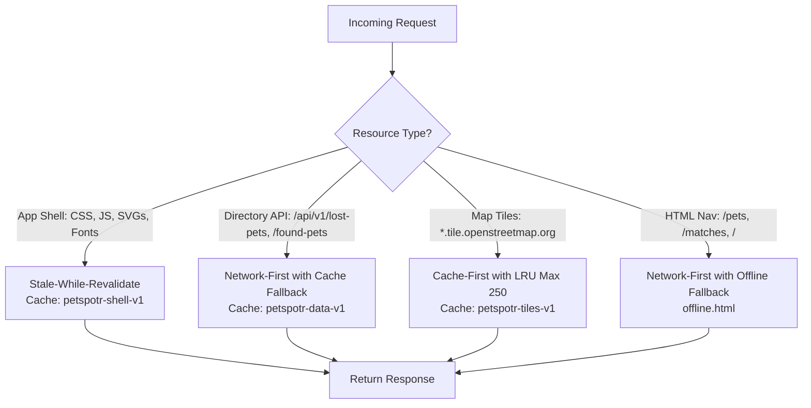
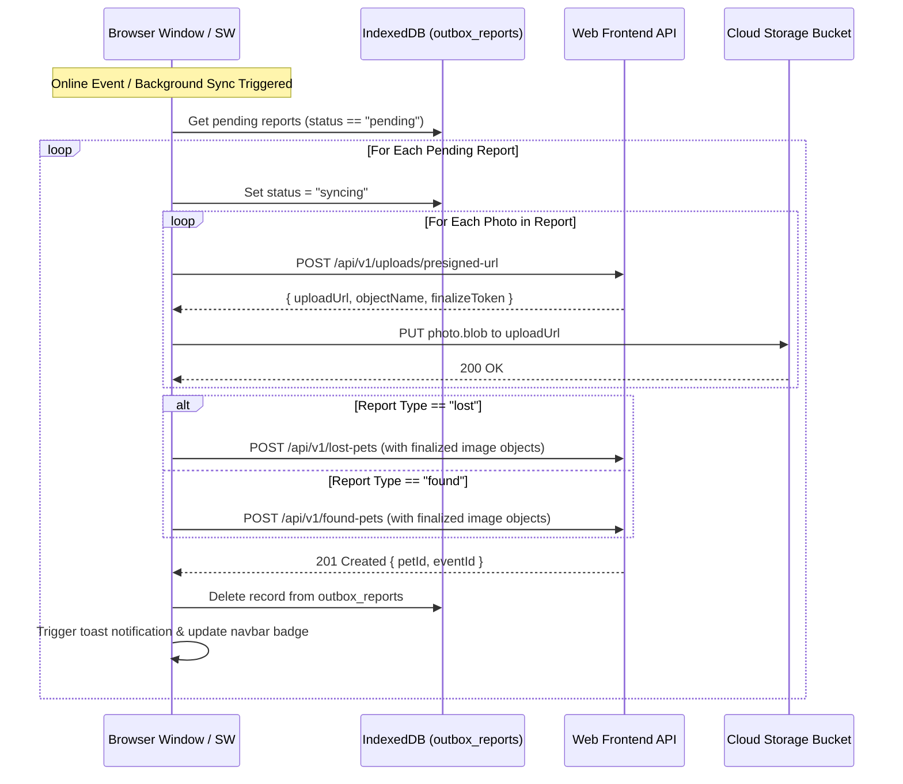

# Design Specification: Offline PWA & Background Sync Engine

- **Date**: 2026-09-13
- **Author**: Antigravity & Scott Densmore
- **Status**: Approved Design Specification
- **Milestone**: Next-Gen Offline Resilience (Milestone 5.4)

---

## 1. Executive Summary

PetSpotR is an event-driven lost and found pet recovery platform. In the field, pet owners and community volunteers frequently search for or report lost pets in rural areas, parks, hiking trails, or cellular dead zones with intermittent or zero internet connectivity.

This specification details the architecture and implementation for PetSpotR's **Offline PWA & Background Sync Subsystem**:
1. **Offline App Shell & Asset Caching**: Layered Service Worker (`sw.js`) caching strategies (Stale-While-Revalidate for app shell, Cache-First with LRU eviction for OpenStreetMap tiles, and Network-First with cache fallback for pet listings).
2. **Client-Side Outbox Persistence**: IndexedDB-backed (`petspotr_offline_db`) outbox storing offline report drafts and binary photo `Blob`s with status tracking.
3. **Orchestrated Reconnection & Background Sync**: Multi-step synchronization pipeline that requests pre-signed URLs, uploads photo blobs to storage, submits report payloads to `/api/v1/lost-pets` and `/api/v1/found-pets`, and prunes the queue.
4. **Accessible UI Indicators & Live Regions**: Non-intrusive connectivity status pill (`#offline-indicator`), outbox count badges, live region toasts, and cached directory status banners.

---

## 2. Architecture & Service Worker Caching

The Service Worker at `internal/app/webfrontend/static/sw.js` intercepts network requests and applies targeted caching strategies according to resource classification:



### 2.1 Cache Stores

- **`petspotr-shell-v1`**:
  - Pre-cached during `install`:
    - `/`
    - `/static/css/styles.css`
    - `/static/favicon.svg`
    - `/static/js/lost-report.js`
    - `/static/js/found-report.js`
    - `/static/js/pet-directory.js`
    - `/static/js/match-dashboard.js`
    - `/static/js/push-notifier.js`
    - `/static/js/outbox-sync.js`
    - `/static/vendor/leaflet/leaflet.js`
    - `/static/vendor/leaflet/leaflet.css`
    - `/static/vendor/leaflet/images/marker-icon.png`
    - `/static/vendor/leaflet/images/marker-shadow.png`
    - `/offline.html`
  - Served via **Stale-While-Revalidate**: cached copy is returned immediately; a network request updates the cache in the background.

- **`petspotr-data-v1`**:
  - Caches responses from `GET /api/v1/lost-pets*` and `GET /api/v1/found-pets*`.
  - Served via **Network-First with Cache Fallback**. On network failure or timeout (> 3 seconds), returns the cached response with header `X-PetSpotR-Offline: true`.

- **`petspotr-tiles-v1`**:
  - Matches `https://*.tile.openstreetmap.org/*`.
  - Served via **Cache-First**.
  - Eviction policy: Bounded LRU/FIFO with a maximum of 250 tile entries (~5–10 MB) to prevent unbounded mobile storage consumption.

- **Offline Navigation Fallback**:
  - If a top-level HTML navigation request fails while offline and has not been cached, the worker responds with `/offline.html`, rendering a glassmorphic notice with direct navigation buttons to cached sections (`/pets`, `/`).

---

## 3. IndexedDB Outbox Schema & Storage Pipeline

When offline, form submissions cannot obtain pre-signed storage URLs. Reports and raw image files are serialized directly to client IndexedDB.

### 3.1 Database Specification
- **Database Name**: `petspotr_offline_db`
- **Version**: `1`
- **Store Name**: `outbox_reports`
  - Primary Key (`keyPath`): `id` (UUID generated via `crypto.randomUUID()`)
  - Indexes:
    - `by_status`: `status` (`"pending" | "syncing" | "failed"`)
    - `by_created`: `createdAt` (ISO 8601 string)

### 3.2 Outbox Record Interface
```typescript
interface StagedPhoto {
  fileName: string;
  contentType: string;
  tag: 'primary' | 'face' | 'coat' | 'collar';
  blob: Blob; // Stored natively in IndexedDB
}

interface OutboxReportRecord {
  id: string;                      // Unique UUID
  type: 'lost' | 'found';          // Report classification
  payload: Record<string, any>;    // Form field values (petName, species, location, coordinates, etc.)
  photos: StagedPhoto[];           // Array of 0-3 staged photo Blobs
  status: 'pending' | 'syncing' | 'failed';
  attempts: number;                // Failure retry counter (max 5)
  lastError?: string;              // Error message if failed
  createdAt: string;               // ISO 8601 creation timestamp
}
```

### 3.3 Form Submission Interception
In both `lost-report.js` and `found-report.js`:
1. The submission handler checks `navigator.onLine`.
2. If offline, or if a network error (`TypeError: Failed to fetch`) occurs during submission:
   - Extracted photo files (from multi-photo staging array) are extracted as binary `Blob` objects.
   - The report record is inserted into `outbox_reports` with `status: 'pending'`.
   - The UI displays an alert: *"You are offline. Your report has been saved to your outbox and will automatically submit when you reconnect."*
   - The form is cleared.
   - `OutboxSync.registerSync()` is called.

---

## 4. Reconnection & Background Sync Pipeline



### 4.1 Synchronization Dual Triggers
1. **Background Sync API (`self.registration.sync`)**:
   - Registers tag: `petspotr-outbox-sync`.
   - Fires in Service Worker upon network restoration even if tabs are closed.
   - On completion without open tabs, displays system notification: `PetSpotR: Your queued pet report was successfully published.`
2. **Window `online` Fallback**:
   - For browsers lacking Background Sync API (e.g. Safari), `outbox-sync.js` hooks `window.addEventListener('online', ...)` and executes the queue replay while active.

### 4.2 Retry & Error Handling
- **Transient Failures (HTTP 5xx, Network Drops)**: `attempts` incremented; record remains `pending` with exponential backoff delay (`Math.min(60000, 1000 * 2 ** attempts)`).
- **Client Errors (HTTP 4xx)**: Marked `failed` with `lastError` captured, alerting user on next visit rather than infinitely retrying invalid data.

---

## 5. UI, Indicators & Accessibility

### 5.1 Connectivity & Outbox Status Pill
Located in `internal/app/webfrontend/templates/layout.html` within `.nav-actions`:
```html
<div id="offline-indicator" class="offline-pill" role="status" aria-live="polite" hidden>
  <span class="offline-dot" aria-hidden="true"></span>
  <span id="offline-status-text">Offline</span>
  <span id="outbox-count-badge" class="badge badge-warning" hidden>0</span>
</div>
```

- **States**:
  - `Online & Outbox Empty`: Element is hidden.
  - `Offline`: Displays amber dot and text `⚡ Offline`.
  - `Offline with Queued Items`: Displays `⚡ Offline • N queued`.
  - `Syncing`: Blue pulsing dot with text `🔄 Syncing N reports...`.
  - `Sync Complete`: Displays green check `✓ Synced` for 3 seconds before fading out.

### 5.2 Toast Container
A live region container (`#toast-container`) rendered at the bottom-right of the viewport for non-modal status updates (`role="status"`, `aria-live="polite"`).

### 5.3 Cached Directory Notice
When `/pets` renders cached directory listings, a banner displays:
`ℹ️ Viewing cached pet directory. New listings and real-time updates will refresh when reconnected.`

---

## 6. Manifest & Progressive Web App Configuration

- Add web app manifest at `/manifest.webmanifest`:
  - `name`: "PetSpotR — Lost & Found Pet Recovery"
  - `short_name`: "PetSpotR"
  - `start_url`: "/"
  - `display`: "standalone"
  - `background_color`: "#0f172a"
  - `theme_color`: "#4f46e5"
  - `icons`: Scalable SVG icon and PNG fallbacks.
- Serve `/manifest.webmanifest` and `/offline.html` from `internal/app/webfrontend/server.go` with strict security headers.

---

## 7. Verification & Testing Strategy

1. **Playwright E2E Test Suite (`tests/playwright/e2e/offline-pwa-journey.spec.ts`)**:
   - `should serve cached app shell, styles, and directory when offline`
   - `should stage lost and found reports with photos in IndexedDB when offline`
   - `should automatically sync queued reports upon network reconnection and persist on backend`
2. **Unit & Integration Testing**:
   - Go unit tests verifying `manifest.webmanifest` and `offline.html` handlers, MIME types, and CSP compliance.
3. **Repository Verification**:
   - `make verify` (all linters, OpenTofu, yamllint, Go tests `-race -cover`).
   - `npx playwright test` (all 60+ journey tests passing).
