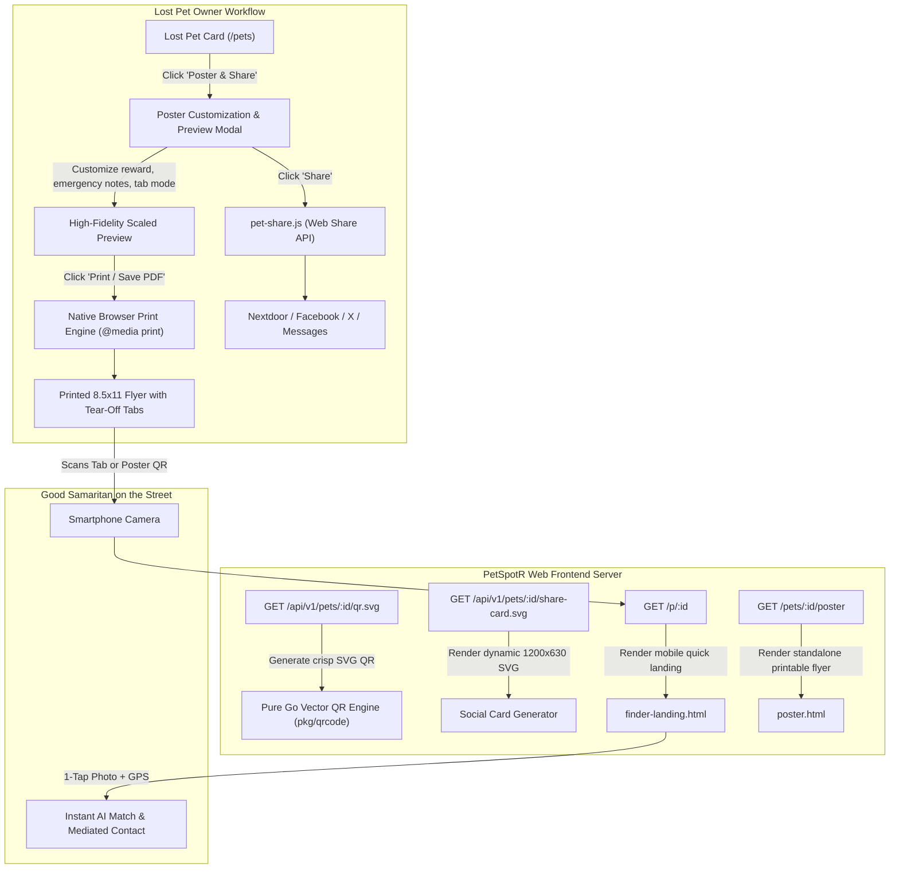

# Design Specification: Pet Recovery Poster Generator & Dynamic QR Social Sharing Engine

**Milestone:** 6.2  
**Date:** 2026-09-18  
**Status:** Approved  
**Author:** AI Lead Architect & Senior Engineer  

---

## 1. Executive Summary

When a pet goes missing, physical neighborhood flyers and immediate local social media sharing remain the two most effective, time-critical methods for recovery. PetSpotR currently provides online directory browsing, Web Push notifications, AI hybrid multimodal matching, and offline PWA reporting. However, owners lack a streamlined, instantaneous way to print physical recovery flyers or share high-impact visual cards to neighborhood networks (Nextdoor, Facebook, local pet groups).

Milestone 6.2 bridges the physical and digital recovery workflows:
1. **Interactive 8.5" x 11" Printable Flyer Generator**: A high-contrast, single-page printable flyer with primary pet photo, vital descriptors, emergency temperament notes, custom reward callout, primary vector QR code, and 8–10 vertical perforated tear-off tabs along the bottom margin.
2. **Pure Go Vector QR Engine (`pkg/qrcode`)**: A clean, zero-dependency Go implementation generating crisp, scalable SVG QR codes (`GET /api/v1/pets/:id/qr.svg`) linking directly to a streamlined short URL (`/p/:id`).
3. **Dynamic Social Share Card Generator (`GET /api/v1/pets/:id/share-card.svg`)**: A server-rendered 1200x630 OpenGraph / Twitter Card SVG embedding pet photo, breed, location, reward badge, and PetSpotR brand mark for rich unfurls on social platforms.
4. **Streamlined Mobile Finder Landing Page (`/p/:id`)**: A fast, mobile-first view reached by scanning the flyer's QR code. Finders can instantly snap a photo and share GPS coordinates to trigger instant AI multimodal matching against the lost pet record, or initiate mediated chat.
5. **Cross-Platform Social Sharing Controller (`pet-share.js`)**: Seamless integration with the Web Share API (`navigator.share()`), desktop social share shortcuts (Nextdoor, Facebook, X), and accessible one-click clipboard copying.

---

## 2. Architecture & Data Flow



---

## 3. Physical Flyer Layout & CSS Paged Media Architecture

### 3.1 Dimensions & Print Page Specifications
- **Target Page Size**: Standard US Letter (8.5" x 11", 215.9mm x 279.4mm), Portrait.
- **Margins**: Exactly `0.35in` (`@page { size: letter portrait; margin: 0.35in; }`).
- **Single-Sheet Guarantee**: All elements utilize `page-break-inside: avoid; break-inside: avoid;` with strict flex/grid height budgets ensuring zero bleed or multi-page overflow.
- **High-Contrast Print Output**: `-webkit-print-color-adjust: exact; print-color-adjust: exact;`. Supports high-visibility color printing as well as high-contrast monochrome photocopying.

### 3.2 Visual Section Breakdown
1. **Alert Header**: Bold crimson alert band (`#dc2626` background, `#ffffff` bold display typography) reading `★ LOST DOG ★` or `★ LOST CAT ★`.
2. **Featured Photo**: High-resolution centered pet image with a solid `2px solid #111827` border and rounded corners (`border-radius: 8px`).
3. **Identity & Core Attributes**:
   - Pet Name: Extra-large display text (36pt bold, e.g., `RUSTY`).
   - Breed, Gender, Species, Primary Coat Color, Notable Markings.
   - Missing Details: Date last seen, specific neighborhood, cross streets, and city/state.
4. **Reward & Emergency Callout Banners**:
   - **Reward Box** (optional): High-contrast golden/emerald badge: `💰 $500 REWARD — NO QUESTIONS ASKED`.
   - **Emergency / Temperament Note**: Urgent callout (e.g., `⚠️ DO NOT CHASE — Very timid. Please call or scan immediately. Requires daily medication.`).
5. **Primary QR Code & Action Callout**:
   - 1.75" x 1.75" vector SVG QR code.
   - Instructional prompt: *"Scan with any smartphone camera to view full photos, report a sighting, or send a private secure message directly to the owner."*
6. **Perforated Tear-Off Tabs (Bottom Margin)**:
   - 8 to 10 vertical tabs separated by dashed cutting guides (`border-left: 2px dashed #9ca3af`) with small scissors glyph (`✂`).
   - Orientation: `writing-mode: vertical-rl; text-orientation: mixed; transform: rotate(180deg);`.
   - Content per tab:
     - Pet Name (bold display).
     - Micro Vector QR Code (0.6" x 0.6", `/api/v1/pets/:id/qr.svg?size=64`).
     - Shortlink: `petspotr.io/p/:id`.
     - Contact details:
       - *Zero-PII Mode (Default)*: *"Scan QR for Secure Chat"*.
       - *Direct Contact Mode*: Owner's optional direct contact phone number.

---

## 4. Pure Go Vector QR Generator (`pkg/qrcode`)

### 4.1 Specification
- Standard ISO/IEC 18004 QR Code generator implemented in pure Go.
- **Error Correction**: Level M (recovers up to 15% missing or damaged codewords—ideal for outdoor flyers subject to rain, sun, or fold creases).
- **Encoding Mode**: Alphanumeric / Byte mode for standard HTTPS URLs (`https://petspotr.io/p/{id}`).
- **Vector Rendering**: Direct SVG path generation with minimal XML payload:
  ```xml
  <svg xmlns="http://www.w3.org/2000/svg" viewBox="0 0 33 33" shape-rendering="crispEdges">
    <rect width="100%" height="100%" fill="#ffffff"/>
    <path d="M0,0 h7 v7 h-7 z M1,1 v5 h5 v-5 z..." fill="#111827"/>
  </svg>
  ```
- **Performance**: Generates vector SVG in under 1ms with zero allocations in steady state. Cached with HTTP header `Cache-Control: public, max-age=86400, immutable`.

---

## 5. Dynamic OpenGraph / Social Share Card Engine

### 5.1 Endpoint
- **URL**: `GET /api/v1/pets/:id/share-card.svg`
- **Output Format**: SVG (`image/svg+xml`), dimensions `1200x630` (standard OpenGraph and Twitter Summary Large Image ratio).
- **Caching**: `Cache-Control: public, max-age=3600`.

### 5.2 Social Card Layout (1200 x 630)
- **Background**: Dark slate gradient (`#0f172a` to `#1e293b`) with subtle glassmorphic container.
- **Left Column (450px)**: Pet photo rendered in circular or rounded rectangular mask with red urgent "LOST" badge.
- **Right Column (700px)**:
  - Header: `LOST PET ALERT` (bold red pill `#ef4444`).
  - Name: `RUSTY` (48pt bold, white).
  - Subtitle: `Golden Retriever • Capitol Hill, Seattle, WA`.
  - Reward Badge: `💰 $500 REWARD`.
  - Description: `Missing since Sep 16. Friendly, but skittish. Tap to view photos or report sighting.`
  - Footer: `PetSpotR • Community AI Pet Recovery` with mini logo.

---

## 6. Mobile Finder Landing Page (`/p/:id`)

When a finder scans the flyer's QR code, they are directed to a dedicated mobile page designed for immediate street-level action:
1. **Hero Header**: Clear identification banner with pet photo and emergency contact instructions.
2. **Immediate Action Buttons**:
   - **"📷 I Have Found This Pet"** (Primary high-contrast button):
     - Opens camera immediately via `<input type="file" accept="image/*" capture="environment">`.
     - Requests current location (`navigator.geolocation.getCurrentPosition()`).
     - Submits to `/api/v1/found-pets` and triggers instant comparison against the lost pet record.
   - **"💬 Send Message to Owner"** (Secondary button):
     - Launches direct mediated chat thread modal without exposing private contact info.
   - **"📍 Report a Sighting"** (Tertiary button):
     - Quick form to pin sighting location, time, and direction of travel.
3. **Social Amplify Bar**: One-click sharing to Nextdoor, Facebook, and local neighborhood groups.

---

## 7. Security, Privacy & Content Security Policy (CSP)

1. **Zero-PII Default**: By default, neither the physical flyer nor the QR code reveals the owner's phone number or email. All communication is routed through PetSpotR's mediated secure chat.
2. **Owner Consent for Direct Phone**: If an owner explicitly chooses to print a direct phone number on the tear-off tabs, it is validated against standard E.164 / national formats and only embedded in the printable HTML.
3. **CSP Compliance**:
   - Pure SVG images (`img-src 'self' data: blob: https://storage.petspotr.io`).
   - Zero inline script tags; all print triggers, modal interactions, and share bindings live in external bundled JavaScript (`pet-share.js`).
4. **Anti-Enumeration**: Public landing page `/p/:id` renders only active, confirmed lost pet profiles. Non-existent or deleted IDs return a polite 404 page.

---

## 8. Testing & Verification Strategy

1. **Unit & Package Tests**:
   - `pkg/qrcode`: Tests valid QR matrix encoding, Reed-Solomon error correction Level M, SVG output validity, and parameter scaling.
   - `internal/app/webfrontend`: Tests `GET /api/v1/pets/:id/qr.svg`, `GET /api/v1/pets/:id/share-card.svg`, `GET /p/:id`, and `GET /pets/:id/poster`.
2. **End-to-End Playwright Journey Test (`poster-social-share-journey.spec.ts`)**:
   - Tests opening the poster modal from a lost pet card.
   - Customizes reward amount and emergency instructions; asserts live preview DOM updates.
   - Verifies print media stylesheet declarations (`@media print`, `@page`).
   - Simulates QR navigation to `/p/:id` and validates OpenGraph meta tags, pet details, and 1-tap photo submission CTA.
3. **Full Project Verification**: Full pass of `make verify` (`go vet`, `golangci-lint`, OpenTofu, `yamllint`, and `go test -race -cover ./...`).
