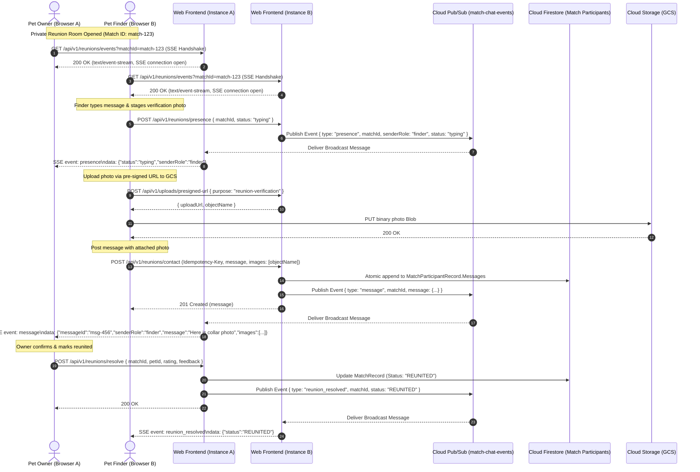

# Milestone 6.1: Real-Time Owner-Finder Secure Chat & Reunion Room Design Specification

## 1. Executive Summary

Milestone 6.1 introduces a real-time, private, mediated communication tunnel ("Reunion Room") between pet owners and pet finders within PetSpotR. The system enables bidirectional communication without exposing either participant's personal email, phone number, or identity provider credentials.

By combining HTTP/2 Server-Sent Events (SSE) for low-overhead client streaming with authenticated REST endpoints for message ingress and Cloud Pub/Sub broadcast distribution across webfrontend instances, the Reunion Room delivers instant live message delivery, verification photo sharing, typing and presence indicators, and in-chat resolution actions with zero external client-side dependencies.

---

## 2. Architecture & Data Flow



### 2.1 Communication Channels
1. **Server-Sent Events (SSE) Stream (`GET /api/v1/reunions/events?matchId=...`)**:
   - HTTP/2 multiplexed, persistent unidirectional stream from server to client.
   - Headers:
     - `Content-Type: text/event-stream`
     - `Cache-Control: no-cache, no-transform`
     - `Connection: keep-alive`
     - `X-Accel-Buffering: no` (disables buffering on Cloud Run and reverse proxies)
   - Periodic 15-second heartbeat ping (`: ping\n\n`) keeps connections alive through Cloud Run idle timeouts.
   - Native browser `EventSource` automatically reconnects upon transient network loss.
2. **REST Ingress**:
   - `POST /api/v1/reunions/contact`: Authenticated message creation with idempotency and optional image attachments.
   - `POST /api/v1/reunions/presence`: Ephemeral presence and typing pings (`typing`, `online`, `idle`).
   - `POST /api/v1/reunions/resolve`: In-chat resolution marking the pet as reunited and closing the thread.

---

## 3. Domain Model & Event Envelope

### 3.1 Domain Model Updates (`pkg/domain/match_thread.go`)

```go
type MediatedMatchMessage struct {
    MessageID  string               `json:"messageId"`
    SenderRole MatchParticipantRole `json:"senderRole"` // "reporter" (Owner) or "finder"
    Message    string               `json:"message"`
    Images     []string             `json:"images,omitempty"` // GCS object names (max 3 per message)
    SentAt     time.Time            `json:"sentAt"`
}
```

Constraints:
- Max 100 messages per match thread (`MaxMediatedMatchMessages = 100`).
- Max 1,000 runes per message body.
- Max 3 images per message, validated against allowed object naming rules (`images/reunions/{matchId}/*`).
- Message append is disallowed if match status is `REUNITED` or `DISMISSED`.

### 3.2 Real-Time Event Envelopes (`pkg/domain/reunion_events.go`)

```go
type ReunionEventType string

const (
    ReunionEventMessageCreated ReunionEventType = "message"
    ReunionEventPresence       ReunionEventType = "presence"
    ReunionEventResolved       ReunionEventType = "reunion_resolved"
)

type ReunionStreamEvent struct {
    EventID   string           `json:"eventId"`
    Type      ReunionEventType `json:"type"`
    MatchID   string           `json:"matchId"`
    Timestamp time.Time        `json:"timestamp"`
    Payload   any              `json:"payload"`
}

type ReunionPresencePayload struct {
    SenderRole MatchParticipantRole `json:"senderRole"` // "reporter" or "finder"
    Status     string               `json:"status"`     // "typing" | "online" | "idle"
}
```

---

## 4. Backend Implementation & Concurrency

### 4.1 In-Memory Connection Hub (`reunion_hub.go`)

Each `webfrontend` instance maintains a thread-safe connection registry:
- Map: `matchId -> map[chan domain.ReunionStreamEvent]struct{}` guarded by `sync.RWMutex`.
- `Subscribe(matchID string) (<-chan domain.ReunionStreamEvent, func())`:
  - Allocates a bounded channel (`cap: 16`).
  - Returns a teardown closure invoked upon HTTP request completion (`r.Context().Done()`).
- `BroadcastLocal(event domain.ReunionStreamEvent)`:
  - Iterates over active channels for the matching `matchId`.
  - Non-blocking `select` drop prevents slow consumers from blocking the server loop.

### 4.2 Multi-Instance Pub/Sub Fanout (`reunion_pubsub.go`)

- Broadcast topic: `match-chat-events`.
- On startup, each instance subscribes to its own ephemeral subscription.
- When an event is published, all listening instances receive it and forward it to locally connected SSE clients for that match.
- Includes an in-memory broadcast fallback when running locally or in unit test environments without Pub/Sub.

---

## 5. Security & Privacy Boundaries

1. **Zero Personal Identifiers**:
   - Real names, emails, phone numbers, and auth subject IDs are never transmitted over SSE or stored in message payloads.
   - Participants are strictly identified by role: `"reporter"` or `"finder"`.
2. **Access Control & Anti-Enumeration**:
   - Endpoints require active session cookies.
   - Non-participants receive HTTP `404 Not Found` (identical to non-existent match IDs).
3. **CSRF & Idempotency**:
   - `POST /api/v1/reunions/contact` requires a valid CSRF token and `Idempotency-Key` header.
4. **Rate Limiting**:
   - Presence pings (`/api/v1/reunions/presence`) throttled to 1 request per 2 seconds per user.

---

## 6. Frontend UI/UX & Reunion Actions

### 6.1 Markup (`matches.html`)
- Upgraded `#match-thread-modal` with:
  - Status header: presence dot (`#match-presence-dot`) and status text (`#match-presence-text`).
  - Live typing indicator: `#match-thread-typing` with animated dots.
  - In-chat action button: `#btn-chat-resolve-reunion` ("🎉 Mark as Reunited").
  - Verification photo staging tray: `#match-thread-staged-tray` with preview thumbnails.
  - Compose form: attachment button (`📷`), message textarea, and send button.
  - Celebratory resolution banner: `#match-thread-resolved-banner` displayed when match is marked `REUNITED`.

### 6.2 Controller (`match-dashboard.js`)
- Initializes native `EventSource('/api/v1/reunions/events?matchId=' + matchID)` on modal open.
- Dispatches debounced presence typing events while typing in the compose textarea.
- Handles incoming `message`, `presence`, and `reunion_resolved` events dynamically.
- Automatically tears down `EventSource` on modal close.

---

## 7. Testing & Verification Plan

1. **Unit Tests**:
   - `pkg/domain/match_thread_test.go`: Validate `MediatedMatchMessage` with image attachments and max limits.
   - `internal/app/webfrontend/reunion_hub_test.go`: Concurrency and race condition testing under 100 concurrent subscribers.
2. **Integration Tests**:
   - `internal/app/webfrontend/reunion_events_test.go`: HTTP SSE streaming, `: ping\n\n` keepalive, authorization guards, and event fanout.
3. **Playwright Multi-User E2E Tests**:
   - `tests/playwright/e2e/reunion-chat-journey.spec.ts`: Dual-browser context (Owner + Finder) testing live typing indicators, verification photo upload and display, and in-chat resolution action.
4. **Full Verification Gate**:
   - `make verify` (100% passing across linters, OpenTofu, and race tests).
   - Full Playwright suite (all journeys passing).
