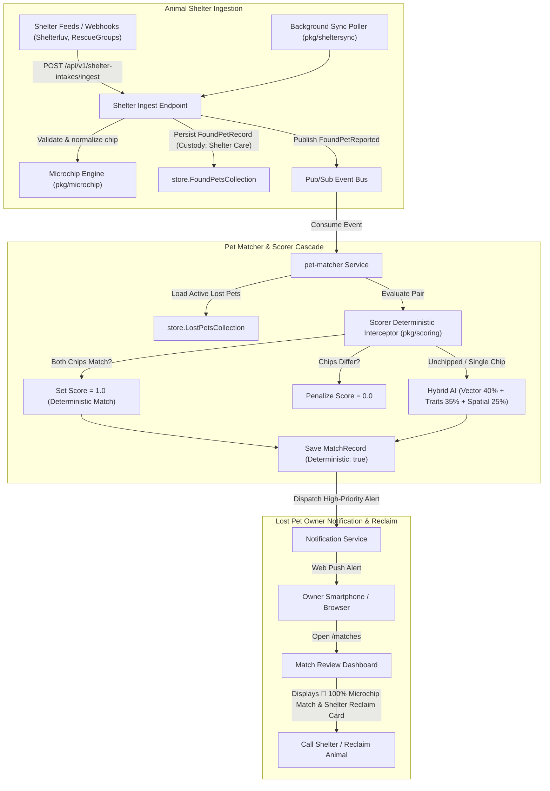

# Design Specification: Shelter & Microchip Registry Integrations

**Milestone:** 6.3  
**Date:** 2026-09-19  
**Status:** Approved  
**Author:** AI Lead Architect & Senior Engineer  

---

## 1. Executive Summary

When pets go missing, their return depends heavily on two critical real-world safety nets: **RFID microchips** and **municipal animal shelters**. While PetSpotR provides community reporting, AI hybrid multimodal image matching, and real-time chat, it currently lacks native microchip transponder processing and external shelter intake ingestion.

Milestone 6.3 introduces an integrated shelter and microchip architecture:
1. **Pure Go Microchip Engine (`pkg/microchip`)**:
   - Universal validation for ISO 11784/11785 (15-digit FDX-B), Avid (9-digit), and Euro/Trovan (10-digit) transponders.
   - Intelligent ICAR manufacturer prefix router identifying issuing pet registries (HomeAgain, AKC Reunite, PetLink, 24Petwatch, BuddyID).
   - Extensible clearinghouse lookup client (`RegistryLookupClient`) with hermetic simulation and live API adapter support.
   - Privacy-preserving masking (`MaskMicrochip`) upholding PetSpotR's Zero-PII wire contract (`HomeAgain ••••3456`).
2. **Deterministic Match Interceptor in Scorer & Matcher**:
   - Short-circuits probabilistic tri-factor AI scoring when matching verified microchip numbers, guaranteeing an exact `1.0` (100% confidence) deterministic match.
   - Penalizes candidate scores to `0.0` when conflicting verified microchips are detected.
   - Retains multimodal visual comparison for owner visual verification.
3. **Shelter Intake Ingestion Pipeline (`internal/app/sheltersync` & Web Frontend)**:
   - Ingests normalized shelter intake records (`POST /api/v1/shelter-intakes/ingest` and background poller) supporting Shelterluv, RescueGroups, and municipal shelter feed formats.
   - Automatically synthesizes found pet records with `CustodyStatus: "Shelter Care"`, embedding shelter name, intake ID, and reclaim contact information.
   - Dispatches `FoundPetReported` events into Pub/Sub, triggering instant `pet-matcher` evaluation.
4. **Owner Shelter Reclaim UX & Match Badges**:
   - Real-time Web Push and in-app alerts alerting owners when a matching animal is admitted to a shelter.
   - Match dashboard displays an emerald `🎯 100% Verified Microchip Match` banner and direct shelter reclaim actions (`📞 Call Shelter`, `📍 Directions to Shelter`, intake reference ID).
   - Microchip registration in lost and found report wizards with live client-side validation.

---

## 2. Architecture & Data Flow



---

## 3. Microchip Standard Formats, Validation & Prefix Routing (`pkg/microchip`)

### 3.1 Transponder Formats & Standards
1. **ISO 11784/11785 FDX-B**:
   - 15 decimal digits.
   - First 3 digits represent the ICAR manufacturer code or ISO 3166 country code.
   - Example: `985141000123456`.
2. **Avid Standard (9-digit)**:
   - 9 decimal digits.
   - Common in legacy North American veterinary implants.
   - Format: `123456789` or `123*456*789`.
3. **Euro / Trovan (10-digit)**:
   - 10 alphanumeric characters (hex-compatible).
   - Format: `00064A12B3`.

### 3.2 ICAR Manufacturer Code Prefix Mapping
The engine maps the leading 3 digits of 15-digit ISO transponders to their principal issuing pet registry:

| Prefix | Issuing Registry | Clearinghouse | 24/7 Recovery Hotline | Website |
|---|---|---|---|---|
| `985` | HomeAgain (Merck) | AAHA Clearinghouse | 1-888-466-3242 | homeagain.com |
| `981` | AKC Reunite | AAHA Clearinghouse | 1-800-252-7894 | akcreunite.org |
| `977` | PetLink (Datamars) | AAHA Clearinghouse | 1-877-738-5465 | petlink.net |
| `982` | 24Petwatch | AAHA Clearinghouse | 1-866-597-2424 | 24petwatch.com |
| `965` | BuddyID (Microchip ID) | AAHA Clearinghouse | 1-800-434-2843 | buddyid.com |
| `900` / `990` | Universal / Shared | AAHA Clearinghouse | Contact Vet/Shelter | aaha.org/petmicrochiplookup |

### 3.3 Privacy-Preserving Masking Contract
To comply strictly with PetSpotR's Zero-PII wire contract, public JSON DTOs and HTML responses never reveal raw microchip numbers:
```go
// MaskMicrochip formats chip numbers for safe public display
// Input: "985141000123456" -> Output: "HomeAgain ••••3456"
// Input: "123456789"        -> Output: "Avid ••••6789"
func MaskMicrochip(raw string) string
```
Only authenticated pet owners in their private report management view or authorized shelter administrators can view unmasked microchip values.

---

## 4. Domain Model Extensions & Deterministic Matching Interceptor

### 4.1 Domain Models ([`pkg/domain`](file:///home/scottdensmore/Developer/scottdensmore/petspotr/pkg/domain))
- **`LostPetRecord` / `LostPetReport`**:
  - `MicrochipID string`: Normalized microchip number.
  - `MicrochipRegistry string`: Issuing registry title.
- **`FoundPetRecord` / `FoundPetReport`**:
  - `MicrochipID string`: Normalized microchip number.
  - `MicrochipRegistry string`: Issuing registry title.
  - `ShelterID string`: Unique shelter identifier.
  - `ShelterName string`: Display name of animal shelter.
  - `IntakeID string`: Shelter impound/intake record number.
  - `CustodyStatus string`: Current custody state (`"shelter_care"`, `"finder_care"`, `"veterinarian"`).
- **`MatchRecord`**:
  - `DeterministicMatch bool`: Flag indicating a positive transponder identification.
  - `MatchType string`: `"deterministic_microchip"` or `"hybrid_multimodal"`.
  - `MatchedMicrochip string`: Masked identifier for verification display.

### 4.2 Deterministic Scorer Interceptor ([`pkg/scoring/scorer.go`](file:///home/scottdensmore/Developer/scottdensmore/petspotr/pkg/scoring/scorer.go))
The scoring engine evaluates the pair:
1. If both records have valid microchips and `lostChip == foundChip`:
   - `OverallScore = 1.0` (100% confidence).
   - `DeterministicMatch = true`.
   - `ScoreBreakdown.MicrochipMatch = 1.0`.
   - Visual trait and multimodal vector embeddings are computed and attached for rich side-by-side photographic comparison.
2. If both records have valid microchips and `lostChip != foundChip`:
   - `OverallScore = 0.0` (Definitive negative match; an animal cannot carry conflicting primary chips).
3. If one or both records lack a microchip:
   - Evaluates standard hybrid AI formula:
     `OverallScore = 0.40 * VectorSim + 0.35 * TraitSim + 0.25 * SpatialProx`.

---

## 5. Shelter Intake Ingestion Engine & Feed Adapters

### 5.1 Ingestion API Endpoint
- **Route**: `POST /api/v1/shelter-intakes/ingest`
- **Headers**:
  - `Content-Type: application/json`
  - `X-Shelter-API-Key: <key>`
- **Payload Schema**:
  ```json
  {
    "shelterId": "shelter-sea-01",
    "shelterName": "Seattle Animal Shelter",
    "shelterAddress": "2061 15th Ave W, Seattle, WA 98119",
    "shelterPhone": "(206) 386-7387",
    "shelterEmail": "shelter@seattle.gov",
    "intakeId": "INT-2026-8819",
    "intakeDate": "2026-09-19T08:00:00Z",
    "animal": {
      "species": "dog",
      "breed": "Golden Retriever",
      "primaryColor": "Golden",
      "gender": "male",
      "description": "Found stray near Interbay. Friendly, scanned microchip on intake.",
      "microchipId": "985141000123456",
      "images": [
        { "url": "https://storage.petspotr.io/shelters/intake-8819.jpg", "view": "primary" }
      ]
    },
    "location": {
      "address": "Interbay, Seattle, WA",
      "latitude": 47.648,
      "longitude": -122.378
    }
  }
  ```

### 5.2 Shelter Sync Service (`pkg/sheltersync`)
Provides an extensible polling service:
```go
type ShelterFeedAdapter interface {
    FetchIntakes(ctx context.Context) ([]ShelterIntakeRequest, error)
}
```
- **`MockShelterFeedAdapter`**: Pre-seeded with realistic Seattle, Bellevue, and King County shelter intake data for deterministic local testing and Playwright E2E verification.
- **`ScheduledSyncWorker`**: Periodically pulls configured feeds and executes ingestion transactions.

---

## 6. Frontend UI, Report Wizards, Masked Badges & Reclaim UX

### 6.1 Report Lost & Found Wizards
- Optional field `#lost-pet-microchip` and `#found-pet-microchip` in traits step.
- Live client-side validation formatting:
  - Valid: `✓ Valid 15-Digit ISO Microchip • HomeAgain Registry`
  - Invalid: `ℹ️ Standard microchips are 15 digits (ISO), 9 digits (Avid), or 10 alphanumeric (Euro).`

### 6.2 Public Directory & Mobile Landing Views
- Public cards display masked badges:
  `<span class="badge badge-microchip">🏷️ HomeAgain (••••3456)</span>`
- Mobile finder view `/p/:id` advises:
  `"This pet is registered with an RFID microchip. Any veterinary clinic or animal shelter can scan this pet for free to verify identity."`

### 6.3 Match Dashboard & Shelter Reclaim UI (`/matches`)
When reviewing a match with shelter custody:
- Prominent header badge: `🎯 100% Verified Microchip Match`.
- Shelter alert banner: `🏛️ Currently in Shelter Care at Seattle Animal Shelter (Intake #INT-2026-8819)`.
- Direct Click-to-Call: `<a href="tel:2063867387" class="btn btn-primary">📞 Call Shelter: (206) 386-7387</a>`.
- Directions Link: `<a href="https://maps.google.com/?q=..." target="_blank" class="btn btn-secondary">📍 Directions to Shelter</a>`.
- Clear reclaim guidance: `"Bring government photo ID and proof of ownership referencing Intake #INT-2026-8819."`

---

## 7. Verification & E2E Testing Strategy

1. **Unit & Package Testing**:
   - `pkg/microchip`: 100% coverage on transponder validation, prefix identification, and masking.
   - `pkg/scoring`: Deterministic 1.0 scoring, conflicting microchip penalty (0.0), and unchipped fallback.
   - `internal/app/webfrontend`: Tests for `POST /api/v1/shelter-intakes/ingest`, query handling, and masked DTO projections.
2. **Playwright E2E User Journey (`tests/playwright/e2e/shelter-microchip-journey.spec.ts`)**:
   - Tests lost pet reporting with microchip and live validation feedback.
   - Tests shelter intake ingestion triggering automatic match candidate creation.
   - Tests match dashboard rendering `🎯 100% Verified Microchip Match` with shelter reclaim actions.
   - Tests conflicting microchips rejecting candidate matches.
3. **Full Project Verification**: Full pass of `make verify` (`go vet`, `golangci-lint`, OpenTofu, `yamllint`, and `go test -race -cover ./...`).
