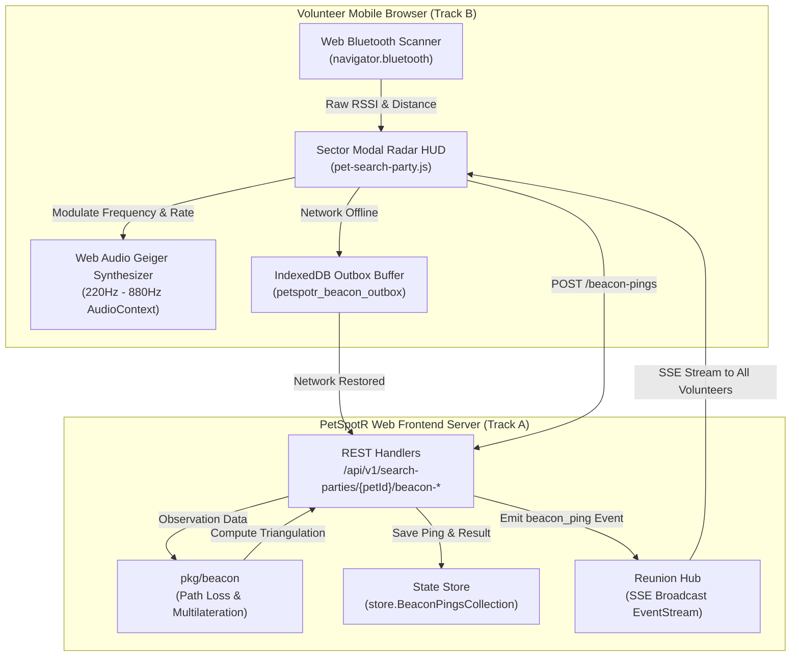

# Design Specification: BLE Collar Beacon Scanning & Proximity Triangulation

## Milestone Overview
- **Milestone**: 10.1
- **Feature Name**: BLE Collar Beacon Scanning & Proximity Triangulation
- **Document Date**: September 20, 2026
- **Status**: Approved by User, Ready for Implementation Planning

---

## 1. Executive Summary & User Problem
During community search parties for lost pets, visual sighting can be hindered by heavy ground cover, darkness, backyards, or pets hiding in culverts and underbrush. Many modern pets wear smart collar tags emitting standard Bluetooth Low Energy (BLE) beacon advertisements (such as Apple AirTags, Tile tags, generic iBeacon, or Eddystone-UID peripherals).

Milestone 10.1 empowers PetSpotR volunteers walking search sectors to passively and actively scan for registered BLE collar beacons directly from their mobile web browser. By measuring Received Signal Strength Indication (RSSI) across one or more volunteer GPS coordinates, PetSpotR calculates real-time distance estimations, provides an intuitive audio "Geiger-counter" proximity guide, dynamically triangulates the pet's coordinates, and enables one-tap sighting logging.

---

## 2. Architectural Architecture & Decomposition

PetSpotR's implementation is divided into two cleanly isolated, concurrent workstreams:



---

## 3. Detailed Component Specifications

### 3.1 Domain Models (`pkg/domain` & `pkg/beacon`)
In `pkg/domain/lost_report.go`, `LostPetRecord` is extended with:
```go
type BeaconProtocol string

const (
    BeaconProtocolIBeacon   BeaconProtocol = "ibeacon"
    BeaconProtocolEddystone BeaconProtocol = "eddystone"
    BeaconProtocolAltBeacon BeaconProtocol = "altbeacon"
    BeaconProtocolCustomBLE BeaconProtocol = "custom_ble"
)

type CollarBeaconConfig struct {
    Protocol       BeaconProtocol `json:"protocol"`
    UUID           string         `json:"uuid,omitempty"`           // iBeacon Proximity UUID or Eddystone Namespace
    Major          *uint16        `json:"major,omitempty"`          // iBeacon Major
    Minor          *uint16        `json:"minor,omitempty"`          // iBeacon Minor
    InstanceID     string         `json:"instanceId,omitempty"`     // Eddystone Instance ID
    DeviceAddress  string         `json:"deviceAddress,omitempty"`  // MAC address / peripheral ID
    DeviceName     string         `json:"deviceName,omitempty"`     // Human label e.g. "PetSpotR-Tag-042"
    CalibratedRSSI int            `json:"calibratedRssi,omitempty"` // Measured RSSI at 1m (default: -59 dBm)
}
```

In `pkg/beacon`:
```go
type BeaconPing struct {
    PingID         string               `json:"pingId"`
    PetID          string               `json:"petId"`
    VolunteerAlias string               `json:"volunteerAlias"`
    ObserverCoords domain.LocationPoint `json:"observerCoords"`
    RSSI           int                  `json:"rssi"`            // dBm
    TxPower1m      int                  `json:"txPower1m"`       // Measured power at 1 meter
    DistanceMeters float64              `json:"distanceMeters"`  // Computed distance
    RecordedAt     time.Time            `json:"recordedAt"`
}

type ProximityZone string

const (
    ProximityImmediate  ProximityZone = "immediate"    // < 1.0m
    ProximityNear       ProximityZone = "near"         // 1.0m - 5.0m
    ProximityFar        ProximityZone = "far"          // 5.0m - 30.0m
    ProximityOutOfRange ProximityZone = "out_of_range" // >= 30.0m
)

type TriangulationResult struct {
    EstimatedCoordinates domain.LocationPoint `json:"estimatedCoordinates"`
    AccuracyRadiusMeters float64              `json:"accuracyRadiusMeters"`
    ObservationCount     int                  `json:"observationCount"`
    LastObservedAt       time.Time            `json:"lastObservedAt"`
    ConfidenceScore      float64              `json:"confidenceScore"` // 0.0 to 1.0
    Proximity            ProximityZone        `json:"proximity"`
}
```

### 3.2 Signal Mathematics & Triangulation Algorithms

#### 1. Log-Distance Path Loss Model
$$d = 10^{\frac{\text{TxPower}_{1\text{m}} - \text{RSSI}}{10 \cdot n}}$$
* $\text{TxPower}_{1\text{m}}$ defaults to $-59\text{ dBm}$ (standard BLE 0 dBm output).
* Path-loss exponent $n \in [2.0, 3.5]$ (default: $2.5$ for suburban park/neighborhood environment).
* Calculated distance is bounded within $[0.1, 100.0]\text{ meters}$.

#### 2. Multilateration / Geometric Estimation
Given $k$ recent observations $(\mathbf{c}_i, d_i)$ within a 15-minute sliding window:
1. **$k = 1$ Observation**:
   $$\mathbf{x}_{\text{est}} = \mathbf{c}_1, \quad r_{\text{accuracy}} = d_1, \quad \text{Confidence} = 0.5$$
2. **$k = 2$ Observations**:
   * Calculate distance $D = \|\mathbf{c}_1 - \mathbf{c}_2\|$.
   * Midpoint weighted by inverse variance:
     $$w_i = \frac{1}{d_i^2}, \quad \mathbf{x}_{\text{est}} = \frac{w_1 \mathbf{c}_1 + w_2 \mathbf{c}_2}{w_1 + w_2}, \quad r_{\text{accuracy}} = \min(d_1, d_2) \cdot 0.85, \quad \text{Confidence} = 0.75$$
3. **$k \ge 3$ Observations**:
   * Solves non-linear least squares minimizing objective:
     $$S(\mathbf{x}) = \sum_{i=1}^k w_i \left( \|\mathbf{x} - \mathbf{c}_i\| - d_i \right)^2$$
   * Initialized with the distance-weighted centroid.
   * If collinear or diverging, falls back smoothly to the centroid with confidence score proportional to geometric spread:
     $$\text{Confidence} = \min\left(0.95, 0.6 + 0.1 \cdot \min(k, 4)\right)$$

### 3.3 Web Frontend REST Handlers & SSE Broadcast
Collection constant: `store.BeaconPingsCollection = "beacon_pings"` in `pkg/store`.

* **`POST /api/v1/search-parties/{petID}/beacon-pings`**:
  * Ingests JSON payload with `volunteerAlias`, `observerCoords`, `rssi`, `txPower1m`, and optional `recordedAt`.
  * Computes distance, stores observation, reads recent pings, computes `TriangulationResult`.
  * Emits `beacon_ping` event over `reunionHub`.
  * Returns `201 Created` with the ping and updated triangulation.
* **`GET /api/v1/search-parties/{petID}/beacon-triangulation`**:
  * Returns `200 OK` with current `TriangulationResult` and active pings list.

### 3.4 Frontend Web Bluetooth Scanner & Audio Geiger Counter (`pet-beacon-scanner.js`)
* **Web Bluetooth Hook**:
  * Listens for BLE advertisements matching registered beacon UUID or device name.
  * Exponential smoothing filter ($\alpha = 0.35$) applied to incoming RSSI values.
  * Supports mock test injection via `window.__mockBluetoothScanner` for headless browser automation.
* **Audio Geiger Counter**:
  * Web Audio `AudioContext` with sine-wave oscillator.
  * Pitch dynamically interpolates from $220\text{Hz}$ to $880\text{Hz}$ as distance decreases.
  * Pulse rate accelerates from 1 click/sec (30m) to 10 clicks/sec (< 2m).
  * Mute/Unmute state with persistent preference in `localStorage`.
* **Sector Modal Radar HUD**:
  * Visual signal bar showing current dBm.
  * Live distance readout (`~3.2m (Near)`).
  * Leaflet map pulse circle (`.beacon-ping-marker`) showing estimated location and confidence circle.
  * One-tap **"Confirm & Log Sighting"** button pre-populating Sighting Modal when in Near/Immediate range.
* **Offline IndexedDB Outbox Buffer**:
  * Pings recorded offline buffer in `petspotr_beacon_outbox` and flush automatically upon reconnection.

---

## 4. Verification Plan

### 4.1 Go Automated Tests
1. **`pkg/beacon`**:
   - `TestEstimateDistance`: tests path loss math at 1m, 3m, 10m, 30m with tolerance $\pm 0.05\text{m}$.
   - `TestTriangulateBeacon_SinglePing`: verifies radius and observer centering.
   - `TestTriangulateBeacon_TwoPings`: verifies weighted overlap calculation.
   - `TestTriangulateBeacon_ThreePings_LeastSquares`: verifies trilateration convergence.
   - `TestTriangulateBeacon_CollinearFallback`: verifies graceful degradation.
   - `TestTriangulate_RaceSafety`: runs 50 concurrent goroutines submitting pings under `-race`.
2. **`internal/app/webfrontend`**:
   - `TestBeaconPingHandler_ValidSubmission`: HTTP 201 and valid JSON response.
   - `TestBeaconPingHandler_InvalidCoordinates`: HTTP 400 rejection.
   - `TestBeaconTriangulationHandler_GetResult`: HTTP 200 with calculated data.

### 4.2 Playwright End-to-End Test Journey (`tests/playwright/e2e/beacon-triangulation-journey.spec.ts`)
1. Create a lost pet with `CollarBeaconConfig` and active search party.
2. Open search party modal, verify "Collar Beacon Scanner" HUD elements are present and accessible.
3. Start scan, toggle audio Geiger counter, verify ARIA status announcements.
4. Simulate BLE pings at decreasing distances, verifying distance HUD and Leaflet map marker updates.
5. Click one-tap "Confirm & Log Sighting" and verify sighting is recorded on the pet's timeline.
6. Simulate offline disconnect, buffer pings, reconnect, and verify automated outbox sync.

### 4.3 Full Repository Pre-Push Check
- Run `export GOTOOLCHAIN=go1.26.5 && make verify` (0 lint issues, OpenTofu valid, yamllint valid, all unit & race tests passing).
- Run full Playwright test suite (118+ tests passing cleanly).
