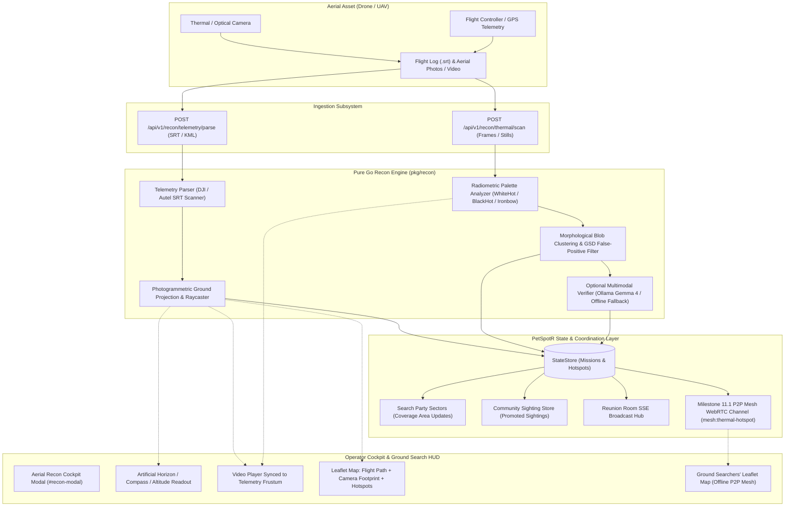

# Milestone 11.2: Drone / UAV Aerial Reconnaissance & Thermal Hotspot Sighting Feeds — Design Specification

## 1. Executive Summary & Problem Statement
Ground search parties and K9 search teams are inherently constrained by rugged terrain, steep elevation gradients, dense underbrush, and limited line of sight. In wilderness lost pet operations, aerial reconnaissance via small Unmanned Aerial Vehicles (UAVs / drones) provides unmatched situational awareness, allowing search coordinators to survey square kilometers of terrain in minutes. However, searchers currently struggle with:
1. **Disconnected Aerial Telemetry**: Drone video files (.mp4/.mov) and flight logs (.srt, .kml) remain siloed on SD cards or isolated pilot ground stations, unable to correlate video frames with real-world map coordinates.
2. **Thermal Signature Overlook**: Operators manually scanning thermal infrared video (White-Hot or Ironbow) easily miss subtle animal heat signatures hidden beneath canopy gaps or behind rock ledges.
3. **High False-Positive Fatigue**: Solar-heated asphalt, sunbaked rock faces, and metal structures create thermal false alarms that distract ground searchers without intelligent spatial/morphological filtering.
4. **Air-to-Ground Coordination Gap**: Field searchers on the ground (operating off-grid via Milestone 11.1 P2P Mesh) have no automated mechanism to receive aerial hotspot coordinates in real time.

Milestone 11.2 establishes an integrated **Drone / UAV Aerial Reconnaissance & Thermal Hotspot Sighting Engine** for PetSpotR. The system delivers:
1. **Dual-Mode Telemetry & Video Ingestion**: Real-time HUD playback synced to DJI/Autel SRT subtitle logs, plus batch drag-and-drop ingestion of aerial photo batches with EXIF georeferencing.
2. **Photogrammetric Ground Projection Engine (`pkg/recon`)**: Pure Go projective geometry calculating the dynamic camera ground frustum, coverage polygons, and pixel-to-coordinate raycasting on terrain.
3. **Pure Go Radiometric Thermal Analyzer**: Pure standard library color-space evaluator supporting White-Hot, Black-Hot, and Ironbow palettes. Applies adaptive standard deviation thresholding, connected-component clustering, and ground-sample-distance (GSD) size filtering to detect animal-scale heat signatures while suppressing uniform solar-heated surfaces.
4. **Optional Multimodal AI Verification Tier**: When Ollama is available, automatically crops candidate heat signatures and validates biological profiles via Gemma 4 (`gemma4:e2b`), with transparent fallback to deterministic metrics in disconnected field environments.
5. **Interactive Aerial Reconnaissance Cockpit (`#recon-modal`, `drone-recon.js`)**: Web-first flight HUD with artificial horizon, compass heading, telemetry readouts, synchronized video scrubber, thermal reticle overlay, and one-click sighting promotion.
6. **Air-to-Ground P2P Mesh Synchronization**: Automatically propagates confirmed thermal hotspots as `mesh:thermal-hotspot` events across connected P2P mesh peers (Milestone 11.1), rendering pulsating flame markers on ground searchers' mobile Leaflet maps with zero cellular connectivity.

---

## 2. System Architecture & Information Flow



---

## 3. Domain Models & Wire Protocol (`pkg/domain/recon.go`)

```go
package domain

import "time"

// FlightStatus represents the operational state of a drone flight sortie.
type FlightStatus string

const (
	FlightStatusActive    FlightStatus = "ACTIVE"
	FlightStatusCompleted FlightStatus = "COMPLETED"
)

// HotspotStatus represents operator or AI verification state of a thermal anomaly.
type HotspotStatus string

const (
	HotspotUnverified HotspotStatus = "UNVERIFIED"
	HotspotConfirmed  HotspotStatus = "CONFIRMED"
	HotspotDismissed  HotspotStatus = "DISMISSED"
)

// ThermalPalette represents the radiometric or pseudocolor palette in use.
type ThermalPalette string

const (
	PaletteWhiteHot ThermalPalette = "WHITE_HOT"
	PaletteBlackHot ThermalPalette = "BLACK_HOT"
	PaletteIronbow  ThermalPalette = "IRONBOW"
)

// NormalizedBox defines a normalized bounding rectangle [0.0 - 1.0].
type NormalizedBox struct {
	X      float64 `json:"x"`
	Y      float64 `json:"y"`
	Width  float64 `json:"width"`
	Height float64 `json:"height"`
}

// DroneWaypoint represents a single telemetry sample during flight.
type DroneWaypoint struct {
	Timestamp      time.Time `json:"timestamp"`
	Latitude       float64   `json:"latitude"`
	Longitude      float64   `json:"longitude"`
	AltitudeAGL    float64   `json:"altitudeMetersAGL"` // Above ground level
	HeadingDeg     float64   `json:"headingDeg"`        // 0-360 true north
	GimbalPitchDeg float64   `json:"gimbalPitchDeg"`    // -90 nadir, 0 horizontal
	GimbalRollDeg  float64   `json:"gimbalRollDeg"`
	GimbalYawDeg   float64   `json:"gimbalYawDeg"`
	GroundSpeedMps float64   `json:"groundSpeedMps"`
	BatteryPercent int       `json:"batteryPercent"`
}

// ThermalHotspot represents a detected biological thermal anomaly.
type ThermalHotspot struct {
	ID                 string         `json:"id"`
	MissionID          string         `json:"missionId"`
	PetID              string         `json:"petId"`
	Timestamp          time.Time      `json:"timestamp"`
	Latitude           float64        `json:"latitude"`
	Longitude          float64        `json:"longitude"`
	EstimatedTempC     float64        `json:"estimatedTempC"`
	ConfidenceScore    float64        `json:"confidenceScore"`    // 0.0 to 1.0
	Palette            ThermalPalette `json:"palette"`
	BoundingBox        NormalizedBox  `json:"boundingBox"`
	FrameTimeOffsetSec float64        `json:"frameTimeOffsetSec"` // Offset into flight video
	ThumbnailBase64    string         `json:"thumbnailBase64,omitempty"`
	Status             HotspotStatus  `json:"status"`
	Classification     string         `json:"classification,omitempty"` // e.g. "Canine Signature", "Heat Anomaly"
	LinkedSightingID   string         `json:"linkedSightingId,omitempty"`
}

// DroneMission tracks an entire aerial reconnaissance sortie.
type DroneMission struct {
	ID               string           `json:"id"`
	PetID            string           `json:"petId"`
	SearchPartyID    string           `json:"searchPartyId,omitempty"`
	PilotCallsign    string           `json:"pilotCallsign"`
	DroneModel       string           `json:"droneModel"`
	StartTime        time.Time        `json:"startTime"`
	EndTime          *time.Time       `json:"endTime,omitempty"`
	Status           FlightStatus     `json:"status"`
	Waypoints        []DroneWaypoint  `json:"waypoints"`
	FootprintPoly    [][]float64      `json:"footprintPolygon"` // Exterior boundary [lng, lat]
	Hotspots         []ThermalHotspot `json:"hotspots"`
	SweptAreaSqM     float64          `json:"sweptAreaSqMeters"`
	CoveredSectorIDs []string         `json:"coveredSectorIds"`
}

// CameraIntrinsics encapsulates camera optical properties.
type CameraIntrinsics struct {
	HFOV float64 // Horizontal field of view in degrees (default 84.0)
	VFOV float64 // Vertical field of view in degrees (default 60.0)
}
```

---

## 4. Telemetry Parsing & Photogrammetric Ground Projection (`pkg/recon/`)

### 4.1 Telemetry Parsing (`pkg/recon/telemetry.go`)
1. **DJI SRT Subtitle Stream Scanner**:
   - Parses standard subtitle blocks:
     ```text
     1
     00:00:01,000 --> 00:00:02,000
     [iso : 100] [shutter : 1/500] [fnum : 2.8] [latitude : 37.774929] [longitude : -122.419416] [rel_alt: 45.200] [heading: 142.5] [pitch: -45.0] [roll: 0.0] [yaw: 142.5]
     ```
   - Regular expression and token scanner extracts latitude, longitude, relative altitude (AGL), heading, gimbal pitch, and timestamp offsets.
   - Robustly handles alternate formatting (e.g. `[dlatitude: ...]`, comma-delimited logs, ISO timestamps).
2. **KML & GeoJSON Linestring Fallback**:
   - Parses GPS coordinates, elevation, and timestamp tags from standard KML `<coordinates>` and GeoJSON `<LineString>` objects.

### 4.2 Photogrammetric Ground Plane Projection (`pkg/recon/projection.go`)
1. **Frustum Ground Footprint**:
   - At drone altitude $h$ (AGL) and gimbal pitch $\phi$ (measured from horizontal, where $-90^\circ$ is nadir downward):
     $$\theta_{near} = |\phi| - \frac{\text{VFOV}}{2}, \quad \theta_{far} = |\phi| + \frac{\text{VFOV}}{2}$$
     $$d_{near} = h \cdot \tan\left(90^\circ - \theta_{near}\right), \quad d_{far} = h \cdot \tan\left(90^\circ - \theta_{far}\right)$$
     $$w_{near} = 2 \cdot \frac{h}{\sin(\theta_{near})} \cdot \tan\left(\frac{\text{HFOV}}{2}\right), \quad w_{far} = 2 \cdot \frac{h}{\sin(\theta_{far})} \cdot \tan\left(\frac{\text{HFOV}}{2}\right)$$
   - Rotates the resulting ground trapezoid by the drone heading $\theta_{heading}$ and translates by the drone GPS location using the local WGS84 meter-to-degree projection:
     $$\Delta\text{lat} = \frac{\Delta y}{111132.95}, \quad \Delta\text{lng} = \frac{\Delta x}{111132.95 \cdot \cos(\text{lat})}$$
   - Generates the 4-corner ground footprint polygon coordinates: `[TopLeft, TopRight, BottomRight, BottomLeft]`.

2. **Pixel-to-Coordinate Raycasting**:
   - For any normalized frame coordinate $(u, v) \in [0, 1] \times [0, 1]$ (where $(0, 0)$ is top-left and $(1, 1)$ is bottom-right):
   - Computes ray direction vector in camera body coordinates, rotates by gimbal pitch/roll/yaw and drone heading, and intersects the flat earth plane at altitude zero relative to drone launch.
   - Outputs ground coordinate $(\text{lat}_g, \text{lng}_g)$.

3. **Sector Intersection & Swept Area**:
   - Tests polygon intersection between the flight footprint and defined search party sectors (Milestone 8.1 / 11.1).
   - Computes surveyed area in square meters using spherical polygon area summation.

---

## 5. Pure Go Radiometric Thermal Analyzer & Multimodal Verification (`pkg/recon/`)

### 5.1 Radiometric Thermal Analyzer (`pkg/recon/thermal.go`)
1. **Palette Processing**:
   - **White-Hot**:
     $$Y = 0.299R + 0.587G + 0.114B$$
     Peak luminance corresponds to peak temperature.
   - **Black-Hot**:
     $$Y_{inv} = 255 - (0.299R + 0.587G + 0.114B)$$
   - **Ironbow (Pseudocolor)**:
     - Measures color temperature progression: purple/blue ($<15\%$) $\to$ magenta/red ($30-50\%$) $\to$ orange/yellow ($60-85\%$) $\to$ bright yellow/white ($>90\%$).
     - High thermal energy detected where $R > 200, G > 160$ and $B < 80$ or $R, G, B > 230$.
2. **Adaptive Thresholding**:
   - Calculates frame mean $\mu$ and standard deviation $\sigma$.
   - Adaptive threshold: $T = \mu + 2.2 \cdot \sigma$. Pixels above $T$ form the binary heat mask.
3. **Connected-Component Labeling & Contouring**:
   - Groups contiguous hot pixels into 8-connected components.
   - Extracts bounding box, centroid, pixel area, and peak pixel value.
4. **False-Positive Suppression**:
   - **GSD Scale Validation**: Given altitude $h$, GSD is $\approx \frac{2 \cdot h \cdot \tan(\text{HFOV}/2)}{\text{imageWidth}}$. An animal heat blob must have ground diameter between $0.2\,\text{m}$ (small cat) and $2.0\,\text{m}$ (large dog). Bounding boxes exceeding this (e.g. roads, roofs, ponds) or smaller than 3 pixels are rejected.
   - **Local Ring Contrast**: Evaluates the ambient ring buffer around the candidate. The mean temperature inside the blob must exceed the surrounding ring by at least $\Delta T_{min}$ ($>15\%$ contrast).
5. **Output**:
   - NormalizedBox coordinates, estimated confidence $(0.0 - 1.0)$, and cropped base64 thumbnail.

### 5.2 Multimodal AI Verification Tier (`pkg/recon/verifier.go`)
- **Integration**:
  - Connects to local Ollama instance (`pkg/ollama`) using model `gemma4:e2b`.
  - Prompts model with cropped candidate image:
    `"Analyze this aerial thermal image crop. Is there a warm-blooded domestic animal (dog, cat, pet) visible? Return JSON: {\"isPet\": boolean, \"confidence\": float, \"category\": string}"`
- **Graceful Fallback**:
  - If Ollama is unreachable, times out after 1.5s, or returns invalid JSON:
    - Retains deterministic radiometric score.
    - Sets classification to `"Thermal Heat Anomaly"`.
    - Does not block or fail the operation.

---

## 6. State Persistence & REST Endpoints (`pkg/store`, `webfrontend`)

### 6.1 StateStore Collections (`pkg/store/store.go`)
- `CollectionReconMissions = "recon_missions"`: Keyed by `missionId`.
- `CollectionReconHotspots = "recon_hotspots"`: Keyed by `hotspotId`.

### 6.2 REST API Specification (`internal/app/webfrontend/recon_handlers.go`)

| Method | Path | Description |
|---|---|---|
| `POST` | `/api/v1/recon/missions` | Registers a drone mission (`petId`, `pilotCallsign`, `droneModel`, `searchPartyId`). |
| `GET` | `/api/v1/recon/missions` | Lists all missions for a pet (`?petId=...`). |
| `POST` | `/api/v1/recon/telemetry/parse` | Ingests `.srt` text, KML, or GeoJSON flight log; returns waypoints, footprint polygon, and covered sector IDs. |
| `POST` | `/api/v1/recon/thermal/scan` | Ingests frame image and telemetry; executes radiometric detection; saves and returns detected hotspots. |
| `PUT` | `/api/v1/recon/hotspots/{id}/status` | Updates hotspot status (`CONFIRMED`, `DISMISSED`). When confirmed, automatically registers an official Community Sighting in `pkg/sighting`. |
| `GET` | `/api/v1/recon/missions/{id}/export` | Exports mission telemetry and hotspots as GeoJSON FeatureCollection. |

### 6.3 P2P Mesh Real-Time Broadcast (Milestone 11.1 Integration)
- When a hotspot is detected or confirmed, emits a WebRTC data channel envelope:
  ```json
  {
    "type": "THERMAL_HOTSPOT",
    "nodeId": "pilot-station-1",
    "lamportClock": 42,
    "timestamp": "2026-09-22T19:00:00Z",
    "payload": {
      "id": "hotspot-101",
      "missionId": "mission-404",
      "petId": "pet-123",
      "latitude": 37.7751,
      "longitude": -122.4192,
      "confidence": 0.88,
      "estimatedTempC": 36.5,
      "palette": "IRONBOW",
      "thumbnail": "data:image/jpeg;base64,..."
    }
  }
  ```
- Ground searchers' client devices running `static/js/mesh-sync.js` receive the message, emit `mesh:thermal-hotspot`, and plot the hotspot marker on their local Leaflet map with zero internet connectivity.

---

## 7. Frontend Drone Reconnaissance Cockpit UI (`drone_modal.html`, `drone-recon.js`, `styles.css`)

### 7.1 Cockpit Modal Template (`templates/drone_modal.html`)
- Accessible dialog (`role="dialog"`, `aria-labelledby="recon-modal-title"`, `aria-modal="true"`).
- Keyboard-accessible tabs (`#tab-recon-cockpit` vs `#tab-recon-batch`):
  - **Live / Video Playback Viewport**:
    - HTML5 video element with overlay `<canvas id="recon-reticle-canvas">` for dynamic bounding boxes.
    - Synchronized scrub slider `#recon-timeline-slider` with play/pause and timecode display.
    - **Telemetry HUD Overlays**:
      - Artificial Horizon & Pitch Gauge (`#hud-attitude`).
      - Digital Heading Compass (`#hud-heading`).
      - Altitude AGL readout in meters (`#hud-altitude`).
      - Ground speed & battery percentage badges (`#hud-speed`, `#hud-battery`).
  - **Batch Photo & Log Dropzone**:
    - Drag-and-drop zone (`#recon-dropzone`) accepting `.srt`, `.kml`, `.geojson`, and `.jpg` files.
    - Progress bar and thumbnail inspection gallery.
- **Hotspot Review Drawer (`#recon-hotspot-drawer`)**:
  - Displays detected thermal hotspots sorted by confidence score.
  - Interactive thumbnail preview, estimated temperature badge, and action buttons:
    - `#btn-confirm-hotspot`: Promotes hotspot to confirmed community sighting.
    - `#btn-dismiss-hotspot`: Flags hotspot as false positive.

### 7.2 Leaflet Map Visualizations
- **Layer 1: Flight Trajectory Polyline** — High-contrast cyan path showing the complete UAV route.
- **Layer 2: Real-Time Dynamic Camera Frustum** — Semi-transparent quadrilateral projected on the terrain matching the drone's current field of view.
- **Layer 3: Pulsating Thermal Hotspot Pins** — Flame markers with CSS radar pulse animation. Clicking a marker reveals the cropped thermal thumbnail and estimated temperature.

### 7.3 Accessibility & CSP Compliance
- Strict WCAG AAA compliance: All text and indicator contrast ratios $\ge 7:1$.
- Strict CSP compliance: Zero inline `<script>`, zero `eval()`, zero inline event handlers.
- Focus trap and Escape key listener on `#recon-modal`.

---

## 8. Comprehensive Testing & Verification Plan

### 8.1 Pure Go Unit & Concurrency Tests
- `pkg/recon/telemetry_test.go`:
  - Parses real-world DJI SRT subtitle streams with various spacing, timecodes, and missing fields.
  - Parses KML / GeoJSON Linestrings with altitude coordinates.
  - Verifies error handling on corrupt subtitle files.
- `pkg/recon/projection_test.go`:
  - Mathematical verification of ground footprint vertices at nadir ($-90^\circ$) and oblique angles ($-45^\circ, -30^\circ$).
  - Raycasting pixel $(u, v)$ to ground coordinate accuracy within 1 meter tolerance.
  - Sector intersection and swept area calculation accuracy.
- `pkg/recon/thermal_test.go`:
  - Radiometric analysis across White-Hot, Black-Hot, and Ironbow test fixtures.
  - False-positive rejection tests: verifies roads/roofs and single-pixel hot spots are suppressed.
  - Biological animal signature detection: verifies correct bounding box and confidence score.
- `pkg/recon/verifier_test.go`:
  - Verifies Ollama response parsing when available and non-fatal fallback when offline.
- `internal/app/webfrontend/recon_handlers_test.go`:
  - Tests all REST endpoints under Go race detector (`-race`).
  - Verifies atomic creation of Community Sighting upon hotspot confirmation.

### 8.2 Automated Playwright E2E User Journey (`tests/playwright/e2e/drone-aerial-recon-journey.spec.ts`)
- **Step 1**: Open Search Party view for an active pet; click `#btn-open-drone-recon`.
- **Step 2**: Ingest sample DJI SRT telemetry log. Verify HUD indicators update (Altitude, Heading, Speed).
- **Step 3**: Verify Leaflet map renders the flight path polyline and dynamic camera footprint quadrilateral.
- **Step 4**: Ingest thermal aerial test image. Assert thermal reticle draws bounding box over heat anomaly and creates pulsating flame pin on Leaflet map.
- **Step 5**: Scrub video timeline slider to 50%; verify drone icon moves along flight path and camera footprint rotates.
- **Step 6**: Click `#btn-confirm-hotspot`; assert hotspot status updates to `CONFIRMED` and new Community Sighting is registered.
- **Step 7**: Verify `mesh:thermal-hotspot` event propagates to peer context.

### 8.3 Repository Verification Gate
- `export GOTOOLCHAIN=go1.26.5 && make verify` must pass cleanly:
  - `go vet ./...` (0 errors)
  - `golangci-lint run` (0 issues)
  - OpenTofu configuration valid
  - `yamllint` clean
  - `go test -race -cover ./...` (100% passing)
- Full Playwright suite passes cleanly (137+ tests passing).
