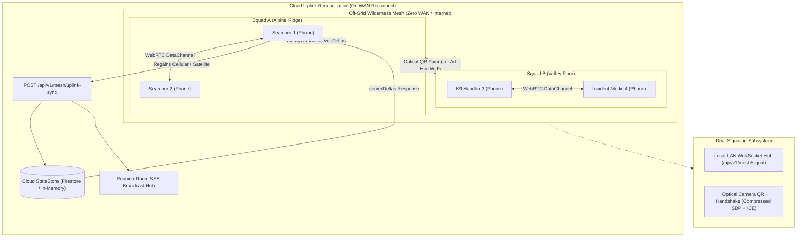

# Milestone 11.1: Off-Grid Peer-to-Peer Mesh Sync & Wilderness Search Coordination — Design Specification

## 1. Executive Summary & Problem Statement
Wilderness lost pet searches and regional disaster relief operations frequently occur in remote backcountry, national forests, and storm-damaged infrastructure zones where cellular reception, satellite broadband, and standard cloud connectivity are completely absent. In these disconnected environments, independent search squads, K9 handlers, and disaster volunteers operate blind to one another's efforts without real-time synchronization. This results in dangerous duplication of search efforts over rugged terrain, delayed notifications of high-value pet sightings, and lost tracking breadcrumbs.

Milestone 11.1 establishes an **Off-Grid Peer-to-Peer Mesh Synchronization & Wilderness Search Coordination Engine** for PetSpotR. The system enables:
1. **Serverless Browser-to-Browser Mesh Networking**: Direct WebRTC DataChannel communication between volunteer devices without requiring external STUN/TURN servers or cloud infrastructure.
2. **Dual-Mode Signaling Engine**:
   - *Local LAN/Hotspot Hub*: Automatic zero-configuration peer pairing over local portable Wi-Fi routers or mobile phone hotspots via Go WebSocket signaling endpoints.
   - *Zero-Infrastructure Optical Handshake*: Air-gapped QR code SDP/ICE candidate exchange via device cameras and vector QR rendering when zero radio networks exist.
3. **Monotonic Conflict-Free Replicated Data Types (CRDTs)**:
   - Sector claims and progression governed by a strictly monotonic state machine (`UNCLAIMED` $\to$ `CLAIMED` $\to$ `SEARCHING` $\to$ `CLEARED`) with Lamport timestamp tie-breaking.
   - GPS breadcrumbs recorded in an append-only Observed-Remove Set (OR-Set) preventing historical trail loss.
   - Field sightings, voice notes, and evacuation manifests replicated via Add-Wins sets with cryptographic hash deduplication.
4. **Interactive Wilderness Coordination HUD & Modal (`#mesh-modal`)**: High-contrast, battery-optimized tactical HUD showing live peer rosters, battery levels, distance estimations, and an emergency Tactical SOS broadcast banner.
5. **Cloud Uplink Reconciliation Engine (`/api/v1/mesh/uplink-sync`)**: Automatic bidirectional sync when any volunteer device regains WAN/cellular access, reconciling field mutations into the cloud `StateStore` and pushing back cloud-side coordinator updates to the mesh.

---

## 2. Architecture & Data Flow



---

## 3. Domain Models & Wire Protocol (`pkg/domain/mesh.go`)

```go
package domain

import (
	"encoding/json"
	"time"
)

// MeshRole represents the tactical role of a volunteer in the wilderness mesh.
type MeshRole string

const (
	MeshRoleSearcher          MeshRole = "SEARCHER"
	MeshRoleIncidentCommander MeshRole = "INCIDENT_COMMANDER"
	MeshRoleK9Handler         MeshRole = "K9_HANDLER"
	MeshRoleMedic             MeshRole = "MEDIC"
)

// MeshNode represents a peer device participating in the off-grid mesh.
type MeshNode struct {
	NodeID          string    `json:"nodeId"`
	VolunteerID     string    `json:"volunteerId"`
	VolunteerName   string    `json:"volunteerName"`
	Role            MeshRole  `json:"role"`
	SearchPartyID   string    `json:"searchPartyId"`
	BatteryLevel    int       `json:"batteryLevel"` // 0-100 percentage
	ConnectedPeers  []string  `json:"connectedPeers"`
	LastSeenAt      time.Time `json:"lastSeenAt"`
}

// MeshMessageType defines message types transferred over WebRTC DataChannels.
type MeshMessageType string

const (
	MeshMsgJoin         MeshMessageType = "JOIN"
	MeshMsgLeave        MeshMessageType = "LEAVE"
	MeshMsgHeartbeat    MeshMessageType = "HEARTBEAT"
	MeshMsgGossipDigest MeshMessageType = "GOSSIP_DIGEST"
	MeshMsgDeltaPayload MeshMessageType = "DELTA_PAYLOAD"
	MeshMsgSOSAlert     MeshMessageType = "SOS_ALERT"
)

// MeshMessage is the standard wire envelope for peer-to-peer data frames.
type MeshMessage struct {
	MessageID     string          `json:"messageId"`
	SearchPartyID string          `json:"searchPartyId"`
	SenderNodeID  string          `json:"senderNodeId"`
	Type          MeshMessageType `json:"type"`
	LamportClock  uint64          `json:"lamportClock"`
	Timestamp     time.Time       `json:"timestamp"`
	Payload       json.RawMessage `json:"payload"`
}

// SectorRank defines the monotonic progression order of search sectors.
type SectorRank int

const (
	SectorRankUnclaimed SectorRank = 0
	SectorRankClaimed   SectorRank = 1
	SectorRankSearching SectorRank = 2
	SectorRankCleared   SectorRank = 3
)

// MeshSectorDelta represents a conflict-free sector state mutation.
type MeshSectorDelta struct {
	PetID                string     `json:"petId"`
	SectorID             string     `json:"sectorId"`
	State                string     `json:"state"` // UNCLAIMED, CLAIMED, SEARCHING, CLEARED
	Rank                 SectorRank `json:"rank"`
	ClaimedByVolunteerID string     `json:"claimedByVolunteerId"`
	ClaimedByName        string     `json:"claimedByName"`
	LamportClock         uint64     `json:"lamportClock"`
	Timestamp            time.Time  `json:"timestamp"`
}

// MeshBreadcrumbDelta represents a volunteer GPS point.
type MeshBreadcrumbDelta struct {
	PetID         string    `json:"petId"`
	VolunteerID   string    `json:"volunteerId"`
	VolunteerName string    `json:"volunteerName"`
	Seq           uint64    `json:"seq"`
	Latitude      float64   `json:"latitude"`
	Longitude     float64   `json:"longitude"`
	Accuracy      float64   `json:"accuracy"`
	Timestamp     time.Time `json:"timestamp"`
}

// MeshSightingDelta represents a field sighting logged offline.
type MeshSightingDelta struct {
	SightingID       string    `json:"sightingId"`
	PetID            string    `json:"petId"`
	VolunteerID      string    `json:"volunteerId"`
	VolunteerName    string    `json:"volunteerName"`
	Latitude         float64   `json:"latitude"`
	Longitude        float64   `json:"longitude"`
	Notes            string    `json:"notes"`
	MediaChunkID     string    `json:"mediaChunkId,omitempty"`
	PhotoThumbBase64 string    `json:"photoThumbBase64,omitempty"`
	LamportClock     uint64    `json:"lamportClock"`
	Timestamp        time.Time `json:"timestamp"`
}

// MeshEvacuationDelta represents a field update to animal disaster rosters.
type MeshEvacuationDelta struct {
	IntakeID     string    `json:"intakeId"`
	PetID        string    `json:"petId"`
	FacilityID   string    `json:"facilityId"`
	Status       string    `json:"status"`
	LamportClock uint64    `json:"lamportClock"`
	Timestamp    time.Time `json:"timestamp"`
}

// MeshSOSAlert represents a distress beacon broadcast across the mesh.
type MeshSOSAlert struct {
	AlertID       string    `json:"alertId"`
	VolunteerID   string    `json:"volunteerId"`
	VolunteerName string    `json:"volunteerName"`
	Latitude      float64   `json:"latitude"`
	Longitude     float64   `json:"longitude"`
	Message       string    `json:"message"`
	Timestamp     time.Time `json:"timestamp"`
}

// MeshBatchDelta is the synchronization payload exchanged during gossip or cloud uplink.
type MeshBatchDelta struct {
	SearchPartyID string                `json:"searchPartyId"`
	SenderNodeID  string                `json:"senderNodeId"`
	Sectors       []MeshSectorDelta     `json:"sectors,omitempty"`
	Breadcrumbs   []MeshBreadcrumbDelta `json:"breadcrumbs,omitempty"`
	Sightings     []MeshSightingDelta   `json:"sightings,omitempty"`
	Evacuations   []MeshEvacuationDelta `json:"evacuations,omitempty"`
	SOSAlerts     []MeshSOSAlert        `json:"sosAlerts,omitempty"`
}

// MeshUplinkSyncResponse is returned by the cloud backend upon WAN reconciliation.
type MeshUplinkSyncResponse struct {
	Success               bool            `json:"success"`
	ReconciledSectors     int             `json:"reconciledSectors"`
	ReconciledBreadcrumbs int             `json:"reconciledBreadcrumbs"`
	ReconciledSightings   int             `json:"reconciledSightings"`
	ReconciledEvacuations int             `json:"reconciledEvacuations"`
	ServerLatestDeltas    *MeshBatchDelta `json:"serverLatestDeltas,omitempty"`
	SyncedAt              time.Time       `json:"syncedAt"`
}
```

---

## 4. Monotonic CRDT Engine & Conflict Resolution (`pkg/mesh/crdt.go`)

### 4.1 Sector Monotonicity Algorithm
Search sector progress in wilderness SAR operations follows strict physical protocols. A sector marked `CLEARED` by ground searchers cannot be reverted to `UNCLAIMED` by a delayed gossip frame:
1. **Rank Comparison**: When receiving a sector update $U$ for sector $S$:
   $$\text{Rank}(U) > \text{Rank}(S) \implies S \leftarrow U$$
2. **Same Rank Tie-Breaking**: If $\text{Rank}(U) == \text{Rank}(S)$:
   $$\text{Lamport}(U) > \text{Lamport}(S) \implies S \leftarrow U$$
   If $\text{Lamport}(U) == \text{Lamport}(S)$:
   $$\text{NodeID}(U) > \text{NodeID}(S) \implies S \leftarrow U \quad \text{(Lexicographical tie-breaker)}$$
3. **Stale Protection**: If $\text{Rank}(U) < \text{Rank}(S)$, the incoming update is discarded as stale.

### 4.2 Append-Only Breadcrumb Log
- Maintained as an append-only collection keyed by composite unique key: `(volunteerId, seq)`.
- If a duplicate sequence number is received from the same volunteer, the point with the more recent timestamp is retained.
- Total distance and boundary coverage calculations execute purely monotonically.

### 4.3 Add-Wins Sighting & Manifest Log
- Field sightings and evacuation entries are indexed by their respective `sightingId` or `intakeId`.
- Updates to existing notes or statuses resolve using standard Last-Write-Wins (LWW) via Lamport clock comparisons.

### 4.4 Anti-Entropy Digest Protocol
- Peers maintain a vector summary of known sector clocks and highest breadcrumb sequence numbers.
- Every 5 seconds (or upon new peer connection), nodes exchange a compact `GOSSIP_DIGEST`.
- Peers respond with a `DELTA_PAYLOAD` containing only missing records, preventing duplicate transmission of large payloads.

---

## 5. Dual-Mode Signaling Subsystem

### 5.1 Mode 1: Local LAN / Hotspot Signaling (`internal/app/webfrontend`)
- **Route**: `GET /api/v1/mesh/signal` (HTTP Upgrade to WebSocket or SSE fallback).
- **Operation**:
  - Automatically joins a signaling channel keyed by `searchPartyId`.
  - Relays WebRTC signaling envelopes:
    - `{"type": "offer", "targetNodeId": "node-b", "sdp": "..."}`
    - `{"type": "answer", "targetNodeId": "node-a", "sdp": "..."}`
    - `{"type": "ice_candidate", "targetNodeId": "node-b", "candidate": "..."}`
  - Zero cloud dependencies; functions entirely when running on a local laptop, phone hotspot server, or battery-powered router.

### 5.2 Mode 2: Zero-Network Optical QR Handshake (`pkg/qrcode`, `static/js/mesh-sync.js`)
- When no Wi-Fi or local IP network is available:
  1. **Initiator**: Creates `RTCPeerConnection` with local candidate gathering. Compresses SDP Offer + Host candidate into a compact URI-safe base64 string.
  2. **Display**: Displays high-density vector QR code on Initiator screen.
  3. **Scanner**: Responder points camera at Initiator screen. Parses SDP Offer, sets remote description, generates SDP Answer, and displays Answer QR code.
  4. **Completion**: Initiator scans Responder's Answer QR code. Direct WebRTC DataChannel opens over local link-local radio.

---

## 6. Client WebRTC Controller & Local Storage (`static/js/mesh-sync.js`)

### 6.1 `MeshSyncController` Module
- **Peer Management**: Coordinates `RTCPeerConnection` and `RTCDataChannel` lifecycles with keep-alive pings (every 3s) and exponential backoff reconnection.
- **Topology**: Full mesh for teams $\le 6$ nodes; structured gossip with forwarding degree $k=4$ and message `TTL=3` for larger search operations.
- **DOM Event Dispatch**:
  - `mesh:peer-joined`: Notifies UI to increment active peer badge and add to peer roster.
  - `mesh:sector-updated`: Signals `search-party.js` to update Leaflet sector colors and claim badges.
  - `mesh:breadcrumb-received`: Updates volunteer trail polyline on the Leaflet map.
  - `mesh:sos-alert`: Triggers high-visibility red flashing banner and audible tone.

### 6.2 Offline IndexedDB Schema (`petspotr-mesh-store`)
- `sectors`: In-memory and persisted sector states with state ranks and Lamport clocks.
- `breadcrumbs`: Monotonic sequence of GPS points.
- `sightings`: Stored offline field sightings with base64 thumbnail blobs.
- `uplink_outbox`: Queue of uncommitted mutations awaiting WAN internet reconnection.

---

## 7. Wilderness Coordination HUD & Modal UI

### 7.1 Top Bar HUD Indicator (`#mesh-status-indicator`)
- High-contrast pill button in the search party view:
  - **Connected**: `⚡ Mesh: 4 Active Peers` (Emerald `#059669`, pulsing dot, contrast ratio > 7.5:1).
  - **Standalone**: `Mesh: Standalone (Offline)` (Amber `#d97706`).
- Accessible `aria-live="polite"` announcements for connection events.

### 7.2 Mesh Network Modal (`#mesh-modal`, `templates/mesh_modal.html`)
- **Peer Roster**: Dynamic list of active searchers, roles (`Searcher`, `Incident Commander`, `K9 Handler`), battery level indicators, and round-trip ping latency.
- **Pairing Controls**:
  - `#btn-mesh-auto-pair`: Initiates local Wi-Fi signaling discovery.
  - `#btn-mesh-show-qr`: Opens optical QR offer generator.
  - `#btn-mesh-scan-qr`: Activates camera scanner viewfinder.
- **Tactical SOS Beacon (`#btn-mesh-sos`)**:
  - High-visibility red distress button (`aria-live="assertive"`).
  - Broadcasts immediate GPS distress alert across all connected mesh peers.

---

## 8. Cloud Uplink Reconciliation Engine (`pkg/mesh/uplink.go`)

### 8.1 Endpoint: `POST /api/v1/mesh/uplink-sync`
- **Request Body**: `MeshBatchDelta`
- **Processing**:
  1. Validates payload and authentication (session / volunteer credentials).
  2. Transactionally reconciles sectors: higher ranks overwrite lower ranks; Lamport tie-breaking resolves identical ranks.
  3. Inserts unique breadcrumbs into `pkg/searchparty` storage.
  4. Appends field sightings to `pkg/sighting` store, creating timeline entries.
  5. Updates evacuation shelter intakes if disaster records were modified.
  6. Collects any server-side mutations newer than the client's vector clock into `serverLatestDeltas`.
  7. Emits real-time SSE events to active Reunion Rooms (`pkg/reunion`).
- **Response**: `MeshUplinkSyncResponse` with counts of reconciled records and `serverLatestDeltas`.

---

## 9. Comprehensive Testing & Verification Plan

### 9.1 Go Unit & Concurrency Tests
- `pkg/mesh/crdt_test.go`:
  - Monotonic sector rank transitions (verify lower rank never overwrites higher rank).
  - Lamport clock tie-breaking and lexicographical node ID ordering.
  - Anti-entropy digest vector generation and delta extraction.
  - Multi-node partition merge simulation (verify 100% convergence across 5 asynchronous nodes).
- `pkg/mesh/uplink_test.go` & `webfrontend/mesh_handlers_test.go`:
  - Uplink handler batch validation, store reconciliation, and race condition testing under `-race`.
  - WebSocket signaling hub concurrent peer joins, broadcasts, and disconnects.

### 9.2 Automated Playwright E2E User Journey (`p2p-mesh-sync-journey.spec.ts`)
- **Setup**: Create lost pet report and initialize search party.
- **Step 1**: Verify `#mesh-status-indicator` presence and accessibility in Search Party view.
- **Step 2**: Open `#mesh-modal`, verify peer roster, optical QR code toggle, and auto-pair controls.
- **Step 3**: Simulate incoming peer sector claim; verify Leaflet sector polygon color and status badge update instantaneously.
- **Step 4**: Simulate incoming breadcrumb coordinates; verify volunteer trail updates on Leaflet map.
- **Step 5**: Click `#btn-mesh-sos`; verify assertive SOS banner displays with alert coordinates.
- **Step 6**: Execute cloud uplink reconciliation via `POST /api/v1/mesh/uplink-sync`; verify cloud persistence.

### 9.3 Repository Verification Gate
- All 124 existing Playwright tests + new journey test passing (125 tests total).
- Full `export GOTOOLCHAIN=go1.26.5 && make verify` clean:
  - 0 lint errors (`golangci-lint`)
  - OpenTofu configuration valid
  - Yamllint clean
  - 100% Go tests passing with `-race -cover`
