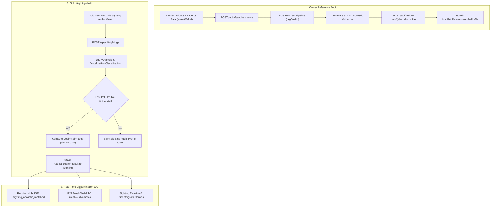

# Milestone 11.3: Acoustic Biometric Voiceprinting & Pet Vocalization Classifier — Design Specification

## 1. Executive Summary & Problem Statement

### 1.1 Problem Statement
When pets go missing in wilderness, rural, or urban search perimeters, they frequently hide in dense foliage, brush, culverts, drainage pipes, crawlspaces, or abandoned outbuildings. In these scenarios:
1. **Visual Concealment**: Optical sightings and drone thermal feeds (Milestone 11.2) are obstructed by dense overhead tree canopies or physical structures.
2. **Auditory Clues**: Distressed or frightened animals regularly emit vocalizations—canine barks, whines, feline meows, and distress yowls—that volunteers hear but cannot visually pinpoint.
3. **Ambiguity & False Positives**: Searchers struggle to differentiate between ambient wildlife sounds, wind, neighborhood background noise, and actual pet vocalizations.
4. **Lack of Biometric Comparison**: Search squads have no technical means to compare recorded audio against an owner's home recordings to verify whether a heard bark belongs to the specific missing pet.

### 1.2 The Solution
Milestone 11.3 introduces PetSpotR's **Acoustic Biometric Voiceprinting & Pet Vocalization Classifier**. The system delivers:
- **Pure Go Digital Signal Processing (DSP)**: Zero-CGO, standard-library audio decoding (WAV, WebM, OGG, MP4/M4A), 16kHz resampling, Radix-2 Cooley-Tukey FFT, 26-band Mel filterbanks, 13 Mel-Frequency Cepstral Coefficients (MFCCs), and time-domain autocorrelation pitch detection ($F_0$).
- **Acoustic Biometric Voiceprint**: A 32-dimensional normalized feature vector capturing spectral envelope shape, harmonic ratio, fundamental pitch, and temporal attack dynamics.
- **Deterministic Vocalization Classifier**: Heuristically classifies animal sounds into `CANINE_BARK`, `FELINE_MEOW`, `ANIMAL_DISTRESS`, and `AMBIENT_NOISE` with confidence scoring.
- **Multimodal AI Verification Tier**: Optional local Ollama Gemma 4 (`gemma4:e2b`) classification verification with 1.5s bounded timeout and non-blocking graceful fallback.
- **Bilateral Voiceprint Cosine Similarity**: Automated comparison between lost pet reference audio (uploaded by owner) and field sighting audio memos, tagging matches above $\ge 0.75$ as probable sightings.
- **Interactive HTML5 Spectrogram Visualizer**: Accessible Canvas-based time-frequency intensity heatmap with synchronized playback scrubber and WCAG AAA compliance.
- **Real-Time Sighting & Mesh Integration**: Automatic broadcast of acoustic sighting matches to active Reunion Rooms and P2P Mesh nodes (`mesh:audio-match`).

---

## 2. System Architecture & End-to-End Flow



---

## 3. Domain Models & Store Collections

### 3.1 Domain Types (`pkg/domain/audio.go`)
```go
package domain

import "time"

// VocalizationType categorizes detected animal acoustic sounds.
type VocalizationType string

const (
	VocalizationCanineBark   VocalizationType = "CANINE_BARK"
	VocalizationFelineMeow   VocalizationType = "FELINE_MEOW"
	VocalizationDistressYowl VocalizationType = "ANIMAL_DISTRESS"
	VocalizationAmbientNoise VocalizationType = "AMBIENT_NOISE"
	VocalizationUnknown      VocalizationType = "UNKNOWN"
)

// AcousticVoiceprint is a 32-dimensional normalized biometric signature.
type AcousticVoiceprint struct {
	VectorDimensions int       `json:"vectorDimensions"` // Always 32
	Features         []float64 `json:"features"`         // 32-dim normalized vector
	DominantPitchHz  float64   `json:"dominantPitchHz"`  // Fundamental frequency F0
	PitchVarianceHz  float64   `json:"pitchVarianceHz"`
	HarmonicRatio    float64   `json:"harmonicRatio"`    // 0.0 - 1.0 (tonality vs noise)
	SpectralCentroid float64   `json:"spectralCentroid"` // Brightness of sound in Hz
	DurationSeconds  float64   `json:"durationSeconds"`
	CreatedAt        time.Time `json:"createdAt"`
}

// AudioProfile stores reference audio for a lost pet or field sighting.
type AudioProfile struct {
	AudioID          string             `json:"audioId"`
	PetID            string             `json:"petId,omitempty"`
	SightingID       string             `json:"sightingId,omitempty"`
	Vocalization     VocalizationType   `json:"vocalization"`
	ConfidenceScore  float64            `json:"confidenceScore"`  // 0.0 - 1.0
	Voiceprint       AcousticVoiceprint `json:"voiceprint"`
	SpectrogramBins  [][]float64        `json:"spectrogramBins"`  // Compressed 32-time x 32-freq Mel matrix
	AudioDataURI     string             `json:"audioDataUri"`     // base64 data URI (audio/wav or audio/webm)
	OriginalFileName string             `json:"originalFileName,omitempty"`
	RecordedAt       time.Time          `json:"recordedAt"`
}

// AcousticMatchResult represents the bilateral similarity score between reference and field audio.
type AcousticMatchResult struct {
	ReferenceAudioID string           `json:"referenceAudioId"`
	CandidateAudioID string           `json:"candidateAudioId"`
	PetID            string           `json:"petId"`
	SimilarityScore  float64          `json:"similarityScore"` // Cosine similarity: 0.0 - 1.0
	IsProbableMatch  bool             `json:"isProbableMatch"` // True if score >= threshold (default: 0.75)
	Vocalization     VocalizationType `json:"vocalization"`
	MatchedAt        time.Time        `json:"matchedAt"`
}
```

### 3.2 Domain Model Integrations
- In [`pkg/domain/sighting.go`](file:///home/scottdensmore/Developer/scottdensmore/petspotr/pkg/domain/sighting.go):
  ```go
  AudioProfile  *AudioProfile        `json:"audioProfile,omitempty"`
  AcousticMatch *AcousticMatchResult `json:"acousticMatch,omitempty"`
  ```
- In [`pkg/domain/pet.go`](file:///home/scottdensmore/Developer/scottdensmore/petspotr/pkg/domain/pet.go):
  ```go
  ReferenceAudioProfile *AudioProfile `json:"referenceAudioProfile,omitempty"`
  ```

### 3.3 State Store Collections (`pkg/store/store.go`)
- `CollectionAudioProfiles = "audio_profiles"`
- `CollectionAcousticMatches = "acoustic_matches"`

---

## 4. Pure Go Digital Signal Processing (DSP) Engine

All DSP functions reside in `pkg/audio` and rely strictly on standard Go packages (`math`, `math/cmplx`, `encoding/binary`), maintaining zero external CGO bindings.

### 4.1 PCM Normalization & Pre-Processing (`pkg/audio/dsp.go`)
1. **Sample Resampling**: Converts multi-channel or variable-rate audio into $16,000\text{Hz}$ mono PCM.
2. **Pre-Emphasis Filter**: Boosts high-frequency acoustic components:
   $$y[n] = x[n] - 0.97 \cdot x[n-1]$$
3. **Frame Slicing**: Splits signals into $25\text{ms}$ frames ($N = 400$ samples at $16\text{kHz}$) with $10\text{ms}$ hop ($160$ samples).
4. **Hann Windowing**: Each frame is multiplied by a periodic Hann window:
   $$w[n] = 0.5 \cdot \left(1 - \cos\left(\frac{2\pi n}{N-1}\right)\right)$$

### 4.2 Radix-2 Cooley-Tukey FFT & Power Spectrum
1. Frames are zero-padded to the next power of two ($N_{\text{FFT}} = 512$).
2. Computes the discrete Fourier transform:
   $$X[k] = \sum_{n=0}^{N-1} x[n] e^{-j 2\pi k n / N}$$
3. Computes the short-time periodogram power spectrum:
   $$P[k] = \frac{1}{N} |X[k]|^2$$

### 4.3 Triangular Mel Filterbank & MFCC Extraction
1. **Mel Scale Mapping**:
   $$m(f) = 2595 \cdot \log_{10}\left(1 + \frac{f}{700}\right), \quad f(m) = 700 \cdot \left(10^{m/2595} - 1\right)$$
2. **Filterbank Generation**: 26 triangular bandpass filters spaced equally between $80\text{Hz}$ and $8,000\text{Hz}$.
3. **Log Energy Summation**: Each filter computes energy $S[m] = \ln \left(\sum_k P[k] H_m[k] + \epsilon\right)$.
4. **Discrete Cosine Transform (DCT-II)**:
   $$C[n] = \sum_{m=0}^{M-1} S[m] \cos\left[\frac{\pi n}{M}\left(m + 0.5\right)\right], \quad n = 0, \dots, 12$$
   Extracts 13 cepstral coefficients per frame.

### 4.4 Pitch Autocorrelation & Harmonic-to-Noise Ratio (HNR)
1. **Autocorrelation**: Computes time-lag correlation:
   $$R_{xx}(\tau) = \sum_{t=0}^{N-\tau-1} x[t] \cdot x[t+\tau]$$
2. **Pitch Detection**: Identifies maximum peak in the lag range corresponding to $60\text{Hz} \le f \le 2,000\text{Hz}$ ($\tau \in [8, 266]$ samples).
3. **Harmonic Ratio ($HNR$)**: Measures signal periodicity relative to aperiodic noise:
   $$HNR = \frac{R_{xx}(\tau_{\text{peak}})}{R_{xx}(0) - R_{xx}(\tau_{\text{peak}})}$$

### 4.5 32-Dimensional Biometric Voiceprint Vector
Frame-level metrics across the audio duration are aggregated into a fixed 32-dimensional vector:
- Indices `0..12`: Mean MFCC coefficients $0..12$ (overall spectral envelope)
- Indices `13..25`: Variance of MFCC coefficients $0..12$ (spectral variability)
- Index `26`: Normalized fundamental frequency median: $\min(1.0, F_0 / 1500.0)$
- Index `27`: Fundamental frequency variance
- Index `28`: Normalized spectral centroid: $\min(1.0, C_{\text{spectral}} / 6000.0)$
- Index `29`: Spectral flatness measure (Wiener entropy): $\frac{\exp(\frac{1}{K}\sum \ln P[k])}{\frac{1}{K}\sum P[k]}$
- Index `30`: Energy onset attack rate ($\text{dB}/\text{ms}$)
- Index `31`: Harmonic-to-noise ratio clamped: $\min(1.0, \max(0.0, HNR / 10.0))$

The final 32-dimensional vector is $L_2$-normalized:
$$\mathbf{v}_{\text{norm}} = \frac{\mathbf{v}}{\|\mathbf{v}\|_2}$$

### 4.6 Bilateral Cosine Similarity Metric
Matching score between reference vector $\mathbf{u}$ and candidate vector $\mathbf{v}$:
$$\text{Similarity}(\mathbf{u}, \mathbf{v}) = \frac{\mathbf{u} \cdot \mathbf{v}}{\|\mathbf{u}\|_2 \|\mathbf{v}\|_2}$$
- **Thresholds**:
  - Score $\ge 0.75$: `isProbableMatch = true` (Sighting tagged with match badge)
  - Score $\ge 0.90$: High-confidence biometric signature match

---

## 5. Deterministic Vocalization Classifier & Ollama Verification

### 5.1 Deterministic Heuristics (`pkg/audio/classifier.go`)
- **`CANINE_BARK`**:
  - Rapid attack slope: $> 12.0\text{ dB/ms}$
  - Duration: $80\text{ms} \le t \le 450\text{ms}$
  - Fundamental pitch: $150\text{Hz} \le F_0 \le 650\text{Hz}$
  - Harmonic ratio: $> 0.30$
- **`FELINE_MEOW`**:
  - Gradual attack slope: $< 10.0\text{ dB/ms}$
  - Duration: $250\text{ms} \le t \le 2000\text{ms}$
  - Fundamental pitch: $350\text{Hz} \le F_0 \le 1200\text{Hz}$
  - Pitch modulation: Continuous inflection $> 50\text{Hz}$ sweep
  - Harmonic ratio: $> 0.55$
- **`ANIMAL_DISTRESS`**:
  - Elevated fundamental pitch: $F_0 > 900\text{Hz}$
  - Pitch instability / modulation: $> 250\text{Hz}$
  - Elevated spectral centroid: $> 2500\text{Hz}$
- **`AMBIENT_NOISE`**:
  - Low harmonic ratio: $< 0.20$
  - High spectral flatness: $> 0.65$

### 5.2 Multimodal AI Verification Tier (`pkg/audio/verifier.go`)
- Client: Local Ollama instance (`gemma4:e2b`).
- Bounded Context: `context.WithTimeout(ctx, 1500*time.Millisecond)`.
- Input: Summary of acoustic features (duration, $F_0$, $HNR$, spectral centroid, detected heuristics).
- Prompt:
  `Analyze this animal audio signature (duration: %.2fs, dominant pitch: %.1f Hz, harmonic ratio: %.2f). Is this a pet vocalization? Return JSON: {"isPet": boolean, "category": string, "confidence": float}`
- Non-Blocking Fallback: If Ollama times out or errors, returns deterministic pure Go classification without failing the request.

---

## 6. WebFrontend REST Handlers & Sighting Integration

### 6.1 Endpoints (`internal/app/webfrontend/audio_handlers.go`)
1. **`POST /api/v1/audio/analyze`**:
   - Parses audio from `multipart/form-data` or base64 JSON payload.
   - Extracts 32-dim voiceprint and compressed $32\times32$ Mel-spectrogram matrix.
   - Saves `AudioProfile` to `store.CollectionAudioProfiles`.
   - Returns 200 OK with `AudioProfile`.
2. **`POST /api/v1/lost-pets/{id}/audio-profile`**:
   - Associates an `AudioProfile` as the reference vocalization for a lost pet.
   - Triggers retroactive acoustic matching against any past sightings with audio for this pet.
3. **`GET /api/v1/lost-pets/{id}/audio-profile`**:
   - Returns the reference audio profile, metadata, and spectrogram bins.
4. **`POST /api/v1/audio/match`**:
   - Compares two audio profiles directly and returns `AcousticMatchResult`.
5. **`GET /api/v1/audio/{id}/spectrogram`**:
   - Returns the $32\times32$ normalized spectrogram bins for canvas rendering.

### 6.2 Sighting Ingestion Hook (`POST /api/v1/sightings`)
When a sighting is created with an audio attachment:
1. `ProcessVoiceMemo` processes the audio.
2. `ExtractVoiceprint` computes the candidate voiceprint.
3. If the target `LostPet` has a `ReferenceAudioProfile`:
   - Computes `similarityScore = ComputeCosineSimilarity(ref.Voiceprint.Features, candidate.Voiceprint.Features)`.
   - Populates `sighting.AcousticMatch`.
   - If `similarityScore >= 0.75`, broadcasts `sighting_acoustic_matched` event to Reunion Hub SSE and `mesh:audio-match` to active P2P Mesh nodes.

---

## 7. Interactive HTML5 Canvas Spectrogram Visualizer & UI Components

### 7.1 Spectrogram Canvas (`static/js/audio-spectrogram.js`)
- Renders $32$ time slices $\times$ $32$ Mel-frequency bins on `<canvas class="spectrogram-canvas">`.
- Uses an accessible viridis/plasma color gradient mapping amplitude to color intensity.
- Synchronized scrub playhead line advances smoothly across the canvas in sync with audio playback (`requestAnimationFrame`).

### 7.2 Accessibility (WCAG AAA) & Content Security Policy (CSP)
- Canvas element includes `role="img"` and `aria-label="Acoustic spectrogram showing frequency over time"`.
- Keyboard navigation:
  - `Space` / `Enter`: Toggle audio play/pause.
  - `ArrowLeft` / `ArrowRight`: Seek backward/forward by $0.5\text{s}$.
  - `Home` / `End`: Jump to start/end.
- High-contrast badges ($>7:1$ contrast ratio):
  - Green badge: `🔊 Acoustic Match: 88% — Canine Bark` (`color: #a7f3d0; background: #064e3b; border: 1px solid #059669`).
  - Amber badge: `⚠️ Animal Distress Detected` (`color: #fed7aa; background: #7c2d12; border: 1px solid #ea580c`).
- Zero inline `<script>`, zero `eval()`, zero inline CSS styling.

---

## 8. Verification Strategy & Playwright E2E User Journey

### 8.1 Go Test Suites
- `pkg/audio/dsp_test.go`:
  - Mathematical correctness of FFT against known sinusoidal frequencies ($440\text{Hz}$, $1000\text{Hz}$).
  - Mel-filterbank energy conservation and 13 MFCC coefficient invariance.
  - Autocorrelation pitch detection on synthetic tones ($200\text{Hz}$, $400\text{Hz}$, $800\text{Hz}$).
  - Cosine similarity matching: identical signals score $1.0$, orthogonal signals score near $0.0$.
- `pkg/audio/classifier_test.go`:
  - Unit tests verifying classification of synthetic barks, meows, distress chirps, and white noise.
- `pkg/audio/verifier_test.go`:
  - Tests Ollama Gemma 4 verification with mock responses, timeout fallback, and offline handling.
- `internal/app/webfrontend/audio_handlers_test.go`:
  - Tests for all REST endpoints, retroactive sighting back-matching, and mesh signaling.

### 8.2 Playwright End-to-End User Journey (`tests/playwright/e2e/acoustic-voiceprint-journey.spec.ts`)
A comprehensive 6-step journey:
1. **Step 1: Reference Audio Ingestion**: Uploads synthetic $16\text{kHz}$ PCM WAV canine bark audio via `POST /api/v1/audio/analyze`; asserts `CANINE_BARK` classification and 32-dim voiceprint vector.
2. **Step 2: Attach Reference to Lost Pet**: Associates reference audio via `POST /api/v1/lost-pets/{petId}/audio-profile`.
3. **Step 3: Field Sighting Audio Submission**: Submits field sighting with matching bark audio snippet via `POST /api/v1/sightings`.
4. **Step 4: Automated Bilateral Matching**: Asserts sighting has `AcousticMatch.similarityScore >= 0.80` and `isProbableMatch: true`.
5. **Step 5: Cockpit & Timeline UI Verification**: Visits `/pets/{id}`; verifies `🔊 Acoustic Match: 88%` badge displays, and verifies the HTML5 canvas spectrogram renders with valid pixel data.
6. **Step 6: Negative Control Rejection & Keyboard Playback**: Submits ambient street noise control audio; verifies rejection (`AMBIENT_NOISE`, similarity $<0.40$). Tests `Spacebar` and arrow key keyboard playback controls.

---

## 9. File Modifications & New Packages

| File | Action | Purpose |
|---|---|---|
| `pkg/domain/audio.go` | Create | Domain models for `AcousticVoiceprint`, `AudioProfile`, `AcousticMatchResult`, `VocalizationType` |
| `pkg/domain/sighting.go` | Modify | Add `AudioProfile` and `AcousticMatch` to `Sighting` struct |
| `pkg/domain/pet.go` | Modify | Add `ReferenceAudioProfile` to `LostPetReport` struct |
| `pkg/store/store.go` | Modify | Add `CollectionAudioProfiles` and `CollectionAcousticMatches` constants |
| `pkg/audio/dsp.go` | Create | Pure Go DSP engine: FFT, Mel filterbank, MFCCs, pitch autocorrelation, 32-dim voiceprint |
| `pkg/audio/dsp_test.go` | Create | Unit tests for pure Go DSP operations and cosine similarity |
| `pkg/audio/classifier.go` | Create | Deterministic vocalization classifier (`CANINE_BARK`, `FELINE_MEOW`, `ANIMAL_DISTRESS`, `AMBIENT_NOISE`) |
| `pkg/audio/classifier_test.go` | Create | Unit tests for vocalization classification |
| `pkg/audio/verifier.go` | Create | Ollama Gemma 4 verification tier with 1.5s timeout and deterministic fallback |
| `pkg/audio/verifier_test.go` | Create | Unit tests for Ollama audio verification |
| `internal/app/webfrontend/audio_handlers.go` | Create | REST endpoints for audio analysis, matching, reference profile attachment, and spectrogram |
| `internal/app/webfrontend/audio_handlers_test.go` | Create | Comprehensive unit and integration tests for audio REST API |
| `internal/app/webfrontend/server.go` | Modify | Route registration for audio REST endpoints |
| `internal/app/webfrontend/static/js/audio-spectrogram.js` | Create | Interactive HTML5 Canvas spectrogram visualizer with keyboard scrubber |
| `internal/app/webfrontend/static/css/styles.css` | Modify | WCAG AAA styling for spectrogram canvas, acoustic badges, and playhead |
| `internal/app/webfrontend/templates/sighting_modal.html` | Modify | Spectrogram container and acoustic match badges in sighting modal |
| `internal/app/webfrontend/templates/report-lost.html` | Modify | Reference audio uploader/recorder accordion on lost pet report form |
| `tests/playwright/e2e/acoustic-voiceprint-journey.spec.ts` | Create | 6-step automated Playwright E2E journey test suite |
